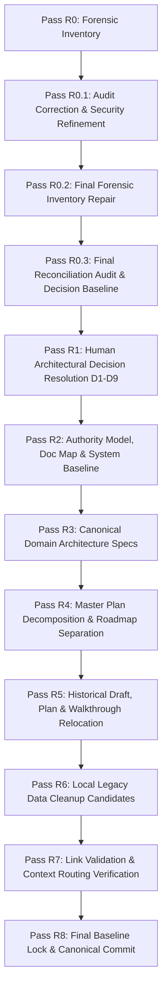
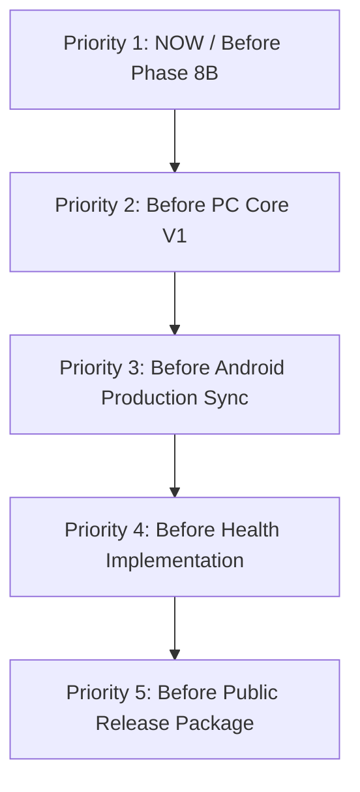

# AI Companion — Repository & Documentation Reconciliation
## Pass R0.3: Final Reconciliation Audit & Decision Baseline

> **Audit Status:** COMPLETED & REVERIFIED (Pass R0.3)  
> **Document Authority:** Non-Canonical Working Audit (Draft)  
> **Target File:** `docs/00_Drafts/REPOSITORY_DOCUMENTATION_RECONCILIATION_AUDIT.md`  
> **Branch Context:** `chore/repository-documentation-reconciliation`  
> **Starting Base Ancestry:** `develop` at commit `ded8c1a5744db54c9cce1d512de169400986bcc0`  
> **Execution Constraint:** Zero physical file reorganizations, zero deletions, zero modifications to existing canonical code or documentation, read-only Git inspection only; zero state-changing Git operations executed; zero staging/history/worktree Git mutations.

---

## 1. Executive Summary

### 1.1 Context & Purpose
The AI Companion repository has reached a critical architectural inflection point. Following the successful completion, local verification, and merge of **Phase 8P** (Runtime Configuration, Model Registry Schema v3, Canonical Persistent Storage, and GitHub Actions CI Foundation), the codebase exhibits robust engineering discipline, strong type contracts, and strict automated verification gates.

However, the repository's documentation has accumulated substantial technical debt across multiple iterative phases:
1. **Centralized Architectural Monolith:** `docs/04_Architecture/AI_COMPANION_MASTER_IMPLEMENTATION_PLAN.md` (1,479 lines, 38 sections) has become an unwieldy monolith that simultaneously attempts to serve as a high-level product pitch, an operational hardware benchmark log, a system architecture blueprint, a sprint-by-sprint Android UI delivery checklist, an AI Studio handoff guide, and an active sprint status tracker.
2. **Documentation Sprawl & Context Inefficiency:** Across `docs/`, 90 tracked documentation files and 4 root-level guides (94 documentation-related tracked files total, 91 Markdown files total) span across historical planning, archived task checklists, delivery walkthroughs, and early draft explorations. An AI agent or human contributor attempting to understand or modify a specific subsystem (e.g., LLM routing, memory, or web UI) is routinely forced to ingest thousands of lines of unrelated or obsolete historical context.
3. **Status and Terminology Inversion:** While the underlying production code has been updated to canonical terminology (`Local AI Runtime`, `COMPANION_DATA_ROOT`, `model_max_context`, `8085` router port, Schema v3 registry), the documentation contains pervasive legacy remnants: 99 occurrences of retired `"Local AI Core"`, 29 references to old port `8080`, outdated test baseline claims (`88 pytest / 132 vitest` vs the current verified baseline of `175 pytest / 147 vitest`), and 91 hardcoded machine/IDE-specific absolute links (`file:///d:/...`).
4. **Authority Fragmentation:** Specialized architecture documents (such as `AI_COMPANION_RUNTIME_CONFIGURATION_AND_ASSET_ARCHITECTURE.md`) provide authoritative, verified contracts for Phase 8P, but their relationship to the master implementation plan and earlier planning documents remains ambiguous.

### 1.2 Automated Verification Baseline (Verified Repository Facts)
As of commit `ded8c1a` on `develop`, the verified automated gates are:
- **Backend Test Suite:** 175 passed in 45.78s (`pytest backend/tests -q`)
- **Frontend Test Suite:** 147 passed in 5.44s (`vitest run --prefix frontend/web`)
- **Frontend Type Integrity:** 0 TypeScript errors (`tsc --noEmit` via `npm run lint`)
- **Frontend Production Bundle:** Vite v6.4.3 production build succeeded in 4.33s (`npm run build`)
- **OpenAPI Drift Gate:** 19 routes verified, all required model routes present, 0 schema drift (`scripts/check_openapi_contract.py`)
- **Automated CI Workflow:** GitHub Actions (`.github/workflows/ci.yml`) enforcing Backend Verification, Frontend Verification, OpenAPI drift verification, and a consolidated `CI Gate` job on ephemeral clean Windows runners.
- **Repository Governance Status:** The `CI Gate` workflow job is implemented and passing, but develop branch protection requiring `CI Gate` before merge is **not yet enforced**.

### 1.3 Scope of Pass R0.3
Pass R0.3 is the **final reconciliation audit and decision baseline** (incorporating forensic repairs from Pass R0.2 and factual corrections from Pass R0.1):
- Establishes the finalized, authoritative repository and documentation audit baseline, reverified against actual codebase reality and read-only Git inspections.
- Incorporates the R0.2 forensic corrections eliminating non-existent/inferred paths across planning, walkthroughs, drafts, and backend services.
- Re-anchors all storage paths to the canonical `%LOCALAPPDATA%\AI Companion\Data` root and standard subdirectories.
- Replaces the simplistic single-ladder authority model with an actionable **question-typed authority matrix**.
- Normalizes overlapping user questions into **9 foundational architectural decisions (D1–D9)** (all remaining strictly `UNDECIDED`).
- Records essential CI Gate failure-aggregation prerequisites before develop branch protection enforcement.
- **No files are moved, renamed, archived, or deleted.**
- **No existing canonical architecture, planning, walkthrough, draft, code, or configuration files are modified.**
- **Read-only Git inspection only; zero state-changing Git operations executed; zero staging/history/worktree Git mutations.**

---

## 2. Repository Tree Findings

The repository comprises 508 tracked files, organized cleanly into domain-specific top-level directories, alongside expected local runtime and data environments.

```text
D:\OtherProjects\AI-companion-project\
├── .aiignore                              # Root AI context ignore rules
├── .cursorignore                          # IDE AI context ignore rules
├── .gitattributes                         # Git LFS pointer tracking configuration
├── .gitignore                             # Git ignore rules (runtimes, venvs, databases)
├── .lfsconfig                             # LFS remote endpoint (Hugging Face datasets)
├── AGENTS.md                              # Canonical pair-programming rules & doc hierarchy
├── CHANGELOG.md                           # Append-only release history (Keep a Changelog)
├── CONTRIBUTING.md                        # Branching, conventional commits, workflow guide
├── README.md                              # Public repository entry point & architecture overview
├── .github/
│   └── workflows/
│       └── ci.yml                         # Automated GitHub Actions CI workflow (3 jobs total: Backend Verification, Frontend Verification, and CI Gate)
├── android/                               # Native Android companion application (182 files)
│   ├── app/                               # Jetpack Compose UI, ViewModel, manual DI, network layer
│   │   ├── build.gradle.kts               # namespace = "com.example", applicationId = "com.aistudio.localcore.swbjtu"
│   │   └── src/main/java/com/example/     # Kotlin source tree (manual AppContainer DI; no Hilt)
│   └── gradle/                            # Gradle wrapper and version catalog (libs.versions.toml)
├── backend/                               # FastAPI Local AI Runtime backend (84 files)
│   ├── .env.example                       # Documented environment variable template
│   ├── alembic.ini                        # Database migration configuration
│   ├── requirements.txt                   # Lower-bound Python constraints (fastapi>=0.115.0; not exact lock)
│   ├── app/                               # Application package
│   │   ├── api/                           # API routes (v1: auth, conversations, health, llm, memories, tasks)
│   │   ├── core/                          # Config, security, canonical storage, errors, logging
│   │   ├── db/                            # SQLAlchemy async engine, session lifecycle (WAL, busy_timeout=5000), Base
│   │   ├── models/                        # ORM models (conversation, message, task, memory)
│   │   ├── schemas/                       # Pydantic v2 schemas (LLM, model registry v3, tasks, etc.)
│   │   └── services/                      # Business logic (llama_cpp, model_registry, assistant orchestrator)
│   ├── migrations/                        # Alembic async migration scripts (head: 005_scope_message_constraints)
│   └── tests/                             # Comprehensive pytest test suite (175 tests)
├── contracts/                             # Canonical API contracts
│   └── openapi/
│       └── openapi.json                   # Exported OpenAPI 3.1.0 schema (19 routes)
├── docs/                                  # Repository documentation hierarchy (90 files)
│   ├── 00_Drafts/                         # Scratchpads, exploratory notes, and audit drafts (5 files)
│   ├── 01_Tracking/                       # Active task.md and sprint archives (17 files)
│   ├── 02_Planning/                       # Implementation plans and TDDs (28 files)
│   ├── 03_Walkthroughs/                   # Delivery walkthroughs and developer handoffs (21 files)
│   ├── 04_Architecture/                   # Canonical architecture, specs, and ADRs (7 files)
│   ├── 05_Design/                         # Product and UX design artifacts (.gitkeep, 1 file)
│   ├── 06_Guides/                         # Contributor guides and checklists (2 files)
│   ├── 07_Archive/                        # Superseded documentation (.gitkeep, 1 file)
│   └── ProjectWorkflowStarterKit/         # Permanent user-owned starter templates (8 files)
├── frontend/
│   └── web/                               # React 19 + TypeScript + Vite desktop control center (138 files)
│       ├── package.json / package-lock.json # Strict npm lockfile present
│       ├── index.html                     # SPA entry point
│       └── src/                           # Components, contexts, API clients, tests
├── models/                                # Model configuration and factory templates
│   ├── registry.template.json             # Factory model registry template (Schema v3)
│   └── [local weights untracked]          # vision/ (Qwen3-VL), tts/ (Kokoro), vad/ (Silero), stt/
├── scripts/                               # Maintenance and contract verification scripts
│   ├── check_openapi_contract.py          # Deterministic OpenAPI drift verification script
│   └── start-model.ps1                    # Manual standalone llama-server launch utility
└── [Ignored / Expected-Local Directories]
    ├── runtime/                           # Local native binaries (gitignored)
    │   ├── llama.cpp/                     # llama-server.exe (b10936 Vulkan build) + DLLs
    │   └── whisper.cpp/                   # whisper native runtime binaries
    ├── data/                              # Local legacy data directory (contains migrated companion.db, logs)
    └── %LOCALAPPDATA%\AI Companion\Data\ # Canonical persistent runtime root (COMPANION_DATA_ROOT)
```

### 2.1 Structural Inventory Table

| Path | Role | Authority / Status | Belongs in Repo? | Logical Placement? | Cleanup Concern / Risk |
| :--- | :--- | :--- | :---: | :---: | :--- |
| `.aiignore` | AI agent context exclusion | Current Canonical | Yes | Yes | None. Protects sensitive tokens and large assets. |
| `.cursorignore` | Cursor IDE context exclusion | Current Canonical | Yes | Yes | None. Mirrors `.aiignore`. |
| `.gitattributes` | Git LFS tracking configuration | Current Canonical | Yes | Yes | Protected boundary. Model weights point to HF LFS. |
| `.gitignore` | Git file exclusions | Current Canonical | Yes | Yes | Accurately ignores `backend/.pytest_cache/` (L34) and root `.pytest_cache/` (L171). |
| `.lfsconfig` | Hugging Face LFS endpoint | Current Canonical | Yes | Yes | Protected boundary. Do not alter without authorization. |
| `AGENTS.md` | Universal pair-programming rules | High Authority | Yes | Yes | Needs alignment on canonical architecture links. |
| `CHANGELOG.md` | Append-only milestone changelog | High Authority | Yes | Yes | Stale: Phase 8A and 8P are not yet appended. |
| `CONTRIBUTING.md`| Branching and commit guide | Canonical Guide | Yes | Yes | Solid industry-standard guide. |
| `README.md` | Project entry point | General Overview | Yes | Yes | Outdated test counts (`88/38`), 748 lines; needs trimming. |
| `.github/workflows/ci.yml` | CI automation workflow | Current Canonical | Yes | Yes | Verified working. Runner-safe environment. |
| `android/` | Android companion app | Active Subsystem | Yes | Yes | Template identities: namespace `com.example`, applicationId `com.aistudio.localcore.swbjtu`. No Hilt; uses manual DI. |
| `backend/` | FastAPI Local AI Runtime | Active Subsystem | Yes | Yes | Highly modular, clean architecture, 175 tests. Python dependencies are minimum constraints (`>=`), not exact locks. |
| `contracts/openapi/`| Canonical API schema | Current Canonical | Yes | Yes | Guarded by CI check script; zero drift. |
| `docs/` | Project documentation | Mixed Authority | Yes | Yes | Major sprawl; subject of this reconciliation. |
| `frontend/web/` | Desktop web control center | Active Subsystem | Yes | Yes | Fast, tested (147 tests), zero tsc errors. Has `package-lock.json`. |
| `models/registry.template.json` | Factory model catalog | Current Canonical | Yes | Yes | Upgraded to Schema v3 in Phase 8P.4. |
| `scripts/check_openapi_contract.py` | Contract drift validation | Current Canonical | Yes | Yes | Used in CI and local pre-commit checks. |
| `scripts/start-model.ps1` | Manual router startup | Developer Utility | Yes | Yes | Retain for standalone benchmarking. |
| `runtime/` (local) | Ignored native runtime binaries | Machine Local | No (Ignored) | Yes | Expected local. Never commit binaries. |
| `data/` (local) | Local legacy storage directory | Stale Local | No (Ignored) | Ambiguous | **Local Legacy Data Cleanup Candidate.** Contains pre-migration `companion.db`. Clean up only after user approval. |
| `%LOCALAPPDATA%\...` | Canonical runtime data root | System Local | No (OS-managed)| Yes | Governed by `COMPANION_DATA_ROOT`. |

---

## 3. Documentation Authority Findings

### 3.1 The Authority Inversion Problem
The primary documentation defect in the AI Companion repository is **Authority Inversion**:
- The project documentation declares `docs/04_Architecture/AI_COMPANION_MASTER_IMPLEMENTATION_PLAN.md` as the "Canonical Source of Truth".
- However, as features have been actively designed and delivered across focused sprints (especially Phase 7, Phase 8A, and Phase 8P), **actual implementation and specialized architecture documents have moved ahead of the master plan**.
- As a result, the master plan contains a mixture of:
  - Genuine unchanging product vision (e.g., local-first, character independence, hardware constraints).
  - Implemented architecture that is partially accurately documented.
  - Outdated claims regarding test counts, API ports, and schema shapes.
  - Granular, low-level sprint delivery checklists (e.g., Android button bounce physics, Jetpack Compose theme padding) that belong in sprint task archives or UI design specs, not a system architecture document.

---

## 4. Complete Documentation Inventory

Below is an exhaustive classification of all 94 documentation files across the repository.

### Classification Categories:
- **CURRENT CANONICAL:** Authoritative source of truth for active system behavior.
- **CURRENT SPECIALIZED CANONICAL:** Authoritative domain-specific architecture document.
- **ACTIVE EXECUTION:** Active tracking document for current work.
- **ACTIVE PLAN:** Implementation plan currently being executed or upcoming.
- **HISTORICAL PLAN:** Implementation plan for a completed, verified milestone.
- **HISTORICAL WALKTHROUGH:** Delivery verification and educational handoff for completed work.
- **DRAFT:** Non-canonical working material or note.
- **SUPERSEDED:** Document whose contents have been replaced by newer specifications.
- **DUPLICATE / OVERLAPPING:** Document containing significant redundant material.
- **ARCHIVE CANDIDATE:** Document recommended for relocation to `07_Archive/` or `01_Tracking/archive/`.
- **UNCLEAR AUTHORITY:** Document whose role or authority is ambiguous.

| # | File Path | Stated Role | Actual Role | Category | Proposed Destination | Recommendation |
| :- | :--- | :--- | :--- | :--- | :--- | :--- |
| 1 | `README.md` | Public Entry Point | Overview & Setup | CURRENT CANONICAL | Root `README.md` | Preserve & Trim stale test metrics (`88/38` -> `175/147`). |
| 2 | `AGENTS.md` | AI Working Rules | Agent System Rules | CURRENT CANONICAL | Root `AGENTS.md` | Preserve; update doc hierarchy references. |
| 3 | `CONTRIBUTING.md` | Engineering Workflow | Git/Branching Guide | CURRENT CANONICAL | Root `CONTRIBUTING.md` | Preserve as-is. |
| 4 | `CHANGELOG.md` | Project Changelog | Release History | CURRENT CANONICAL | Root `CHANGELOG.md` | Append Phase 8A and Phase 8P verified deliveries. |
| 5 | `docs/00_Drafts/09-16-2026-roadmap.md` | Note-friendly Roadmap | User Current Notes | DRAFT (USER-OWNED) | `docs/00_Drafts/` | **DO NOT TOUCH.** User-owned active draft. |
| 6 | `docs/00_Drafts/AI_COMPANION_MASTER_FEATURE_INVENTORY.md` | Feature Inventory (1623L)| Early Prototype Spec | SUPERSEDED / DRAFT | `docs/07_Archive/drafts/` | Archive candidate; superseded by Phase 8 and Master Plan. |
| 7 | `docs/00_Drafts/LOCAL_AI_RUNTIME_AND_WORKFLOW.md` | Runtime Overview (1171L)| Early Explanatory Doc | SUPERSEDED / DRAFT | `docs/07_Archive/drafts/` | Archive candidate; superseded by 8P architecture. |
| 8 | `docs/00_Drafts/MASTER_IMPLEMENTATION_ROADMAP_v2.md` | Roadmap v2 (1822L) | Historical Roadmap Draft| SUPERSEDED / DRAFT | `docs/07_Archive/drafts/` | Archive candidate; heavily duplicates Master Plan. |
| 9 | `docs/00_Drafts/WEB_FRONTEND_STATIC_REVIEW.md` | Static Review (750L) | Initial Web UI Audit | HISTORICAL WALKTHROUGH | `docs/07_Archive/drafts/` | Archive candidate; issues resolved in Phase 5-8. |
| 10| `docs/01_Tracking/task.md` | Active Sprint Tracking | Active Sprint Tracking | ACTIVE EXECUTION | `docs/01_Tracking/task.md` | Trim: Archive completed 8A/8P checklists into archive/. |
| 11-26 | `docs/01_Tracking/archive/task-*.md` (16 files) | Completed Sprints | Sprint Checklists | HISTORICAL ARCHIVE | `docs/01_Tracking/archive/`| Preserve as historical records. |
| 27| `docs/02_Planning/README.md` | Planning Index | Planning Directory Hub | CURRENT CANONICAL | `docs/02_Planning/README.md`| Update links after eventual plan reorganization. |
| 28-38| `docs/02_Planning/android/plan-*.md` (11 files) | Android UI/Sync Plans | Completed Sprint Plans | HISTORICAL PLAN | `docs/02_Planning/archive/android/` | Mark as Completed Historical in header or archive. |
| 39-43| `docs/02_Planning/backend/plan-*.md` (5 files) | Backend Sprint Plans | Completed Sprint Plans | HISTORICAL PLAN | `docs/02_Planning/archive/backend/` | Mark as Completed Historical in header or archive. |
| 44| `docs/02_Planning/phase-08/README.md` | Phase 8 Hub | Phase 8 Index | ACTIVE PLAN | `docs/02_Planning/phase-08/` | Preserve; tracks 8A/8P complete, 8B/8C upcoming. |
| 45| `docs/02_Planning/phase-08/plan-phase8-pc-frontend-architecture-ux.md`| Phase 8 Mega-Plan | Active/Upcoming Plan | ACTIVE PLAN | `docs/02_Planning/phase-08/` | Retain; mark 8A/8P sections complete, 8B/8C active. |
| 46-53| `docs/02_Planning/plan-*.md` (8 files at root) | Cross-cutting plans | Completed Sprint Plans | HISTORICAL PLAN | `docs/02_Planning/archive/`| Historical plans; move to planning archive in Pass R5. |
| 54| `docs/02_Planning/templates/implementation-plan-template.md`| Plan Template | Starter Template | CURRENT CANONICAL | `docs/02_Planning/templates/`| Preserve as template. |
| 55-74| `docs/03_Walkthroughs/walkthrough-*.md` (20 files)| Delivery Walkthroughs | Milestone Handoffs | HISTORICAL WALKTHROUGH | `docs/03_Walkthroughs/` | Preserve; immutable delivery proofs. Organize by domain. |
| 75| `docs/03_Walkthroughs/walkthrough-template.md` | Walkthrough Template | Starter Template | CURRENT CANONICAL | `docs/03_Walkthroughs/` | Preserve as standard template. |
| 76| `docs/04_Architecture/AI_COMPANION_MASTER_IMPLEMENTATION_PLAN.md` | Master System Plan | Monolithic Spec | CURRENT CANONICAL | `docs/04_Architecture/` | Decompose in Pass R2/R3 into modular domain specs. |
| 77| `docs/04_Architecture/AI_COMPANION_RUNTIME_CONFIGURATION_AND_ASSET_ARCHITECTURE.md`| Runtime & Assets Spec | Phase 8P Domain Spec | CURRENT SPECIALIZED CANONICAL | `docs/04_Architecture/domains/`| High authority for runtime, storage, and registry. |
| 78| `docs/04_Architecture/BACKEND_SECURITY_REVIEW_AND_ROADMAP.md`| Security Review & Spec | Security Review + Plan | UNCLEAR AUTHORITY | `docs/04_Architecture/` | Split: Extract Security Architecture vs Security Roadmap. |
| 79| `docs/04_Architecture/LLAMA_CPP_RUNTIME_ARCHITECTURE.md`| llama.cpp Runtime Spec| Subsystem Spec | CURRENT SPECIALIZED CANONICAL | `docs/04_Architecture/domains/`| High authority for router, flags, and states. |
| 80| `docs/04_Architecture/PROACTIVE_COMPANION_ROUTINES` | Proactive Routines Spec| Architectural Note | UNCLEAR / DRAFT | `docs/04_Architecture/domains/`| Fix missing `.md` extension; integrate into Scheduling. |
| 81| `docs/04_Architecture/VOICE_AND_AUDIO_ARCHITECTURE.md`| Voice Pipeline Spec | Subsystem Spec | CURRENT SPECIALIZED CANONICAL | `docs/04_Architecture/domains/`| High authority for audio, STT, TTS, state machine. |
| 82| `docs/04_Architecture/decisions/ADR-0001-github-source-hugging-face-lfs.md`| ADR: Git + HF LFS | Architectural Decision | CURRENT CANONICAL | `docs/04_Architecture/decisions/`| Canonical record of model storage policy. |
| 83| `docs/05_Design/.gitkeep` | Design Assets Folder | Placeholder | INFRASTRUCTURE | `docs/05_Design/` | Retain; reserved for UI/UX wireframes and narrative. |
| 84| `docs/06_Guides/DOCUMENTATION_MAP.md` | Documentation Map | Authority & Navigation Index | CURRENT CANONICAL | `docs/06_Guides/DOCUMENTATION_MAP.md` | Permanent guide location; rewrite in Pass R2/R5 to reflect question-typed authority model. |
| 85| `docs/06_Guides/PROJECT_INPUTS_CHECKLIST.md` | Review Inputs Checklist | Contributor Checklist | CURRENT CANONICAL | `docs/06_Guides/` | Update to remove already-resolved decisions. |
| 86| `docs/07_Archive/.gitkeep` | Documentation Archive | Placeholder | INFRASTRUCTURE | `docs/07_Archive/` | Retain for superseded documents. |
| 87-94| `docs/ProjectWorkflowStarterKit/*` (8 files)| Workflow Reference Kit | Starter Reference Kit | PERMANENT EXCEPTION | `docs/ProjectWorkflowStarterKit/`| **DO NOT TOUCH.** User-owned permanent starter kit. |

---

## 5. Master Plan Section Map

The current master plan (`docs/04_Architecture/AI_COMPANION_MASTER_IMPLEMENTATION_PLAN.md`) contains 1,479 lines and 38 numbered sections. Below is a comprehensive section-by-section analysis and recommended future disposition.

| Sec # | Title | Lines | Current Content Character | Target Authority Category | Analysis & Recommended Disposition |
| :---: | :--- | :---: | :--- | :--- | :--- |
| — | Title & Status Vocabulary | 1–45 | Meta / Status definitions | SYSTEM BASELINE | Retain status vocabulary in System Baseline. Keep exact counts in dated releases. |
| 1 | Vision | 46–70 | Product vision & principles | PRODUCT REQUIREMENTS | Retain core vision principles; move expanded persona goals to Design. |
| 2 | Hardware Target | 71–90 | RX 580 / Ryzen 5 specs | SYSTEM BASELINE | Retain in System Baseline as permanent hardware target. |
| 3 | Architectural Principles | 91–136| Local First, Provider interfaces | SYSTEM ARCHITECTURE | Move to System Architecture / Core Contracts. |
| 4 | Repository Layout | 137–206| Directory tree & roles | GUIDE / REPO MAP | Stale paths (e.g. `provider/`); move to `06_Guides/REPO_LAYOUT.md`. |
| 5 | System Overview | 207–235| ASCII architecture diagram | SYSTEM BASELINE | Update diagram to reflect `COMPANION_DATA_ROOT` & runtime; retain in Baseline. |
| 6 | Current UI State | 236–288| Implemented screens list | STATUS TRACKING | Granular status; move to UI Architecture / Design specifications. |
| 7 | Android Stack | 289–315| Compose, Material3, manual DI | CLIENT ARCHITECTURE | Remove obsolete Hilt mentions; move to `docs/04_Architecture/domains/android-architecture.md`. |
| 7.1 | Hybrid AI Architecture | 316–375| Edge failover, dual-engine | DOMAIN ARCHITECTURE | Move to Android Architecture / Network topology spec. |
| 7.2 | OLED Battery Saver Theme | 376–390| AMOLED styling rules | DESIGN SPECIFICATION | Move to `docs/05_Design/android-ui-spec.md`. Too granular for Master. |
| 8 | Android Navigation | 391–418| BottomBar, Tab switching | DESIGN SPECIFICATION | Move to Android UI spec / Client Architecture. |
| 9 | Android UI Batches | 419–448| Historical batch breakdown | HISTORICAL MATERIAL | Completed implementation batches; archive to historical notes. |
| 10 | Multilingual Requirements | 449–477| Tagalog, Japanese, English | PRODUCT REQUIREMENTS | Move to Product / Persona Requirements (`docs/05_Design/`). |
| 11 | Local AI Runtime | 478–569| llama.cpp router, models | DOMAIN ARCHITECTURE | Duplicated in `LLAMA_CPP_RUNTIME_ARCHITECTURE.md`; reference domain doc. |
| 12 | Model Lifecycle | 570–600| Idle sleep, unload, kill | DOMAIN ARCHITECTURE | Duplicated in `LLAMA_CPP_RUNTIME_ARCHITECTURE.md`; reference domain doc. |
| 13 | Model vs Profile Decoupling| 601–628| Eco/Balanced/Max mappings | DOMAIN ARCHITECTURE | Duplicated in `LLAMA_CPP_RUNTIME_ARCHITECTURE.md` & 8P asset doc. |
| 14 | LLM Routing | 629–643| Router port, model discovery| DOMAIN ARCHITECTURE | Reference `LLAMA_CPP_RUNTIME_ARCHITECTURE.md`. |
| 15 | Backend Foundation | 644–679| FastAPI, SQLAlchemy, lifespan| SYSTEM ARCHITECTURE | Move to `backend-architecture.md`. |
| 16 | Database | 680–772| SQLite, FTS5, Soft delete | DOMAIN ARCHITECTURE | Move to `persistence-and-storage.md`. Highly detailed schema notes. |
| 17 | Contracts | 773–801| Pydantic schemas, OpenAPI | SYSTEM ARCHITECTURE | Reference `contracts/openapi/openapi.json` and API contract docs. |
| 18 | Memory | 802–845| Conversation memory, FTS5 | DOMAIN ARCHITECTURE | Move to dedicated `memory-architecture.md` (currently missing domain doc!). |
| 19 | Tools | 846–871| Local tools, bash/python | DOMAIN ARCHITECTURE | Move to `tools-and-automation.md` (future architecture). |
| 20 | Scheduling and Alarms | 872–893| Cron, reminders, UTC | DOMAIN ARCHITECTURE | Move to `scheduling-and-tasks.md` (currently missing domain doc!). |
| 21 | Voice Pipeline & Audio | 894–934| STT, TTS, VAD, Kokoro | DOMAIN ARCHITECTURE | Duplicates `VOICE_AND_AUDIO_ARCHITECTURE.md`; retain high-level link. |
| 22 | Voice State Machine | 935–956| Idle, Listening, Speaking | DOMAIN ARCHITECTURE | Duplicates `VOICE_AND_AUDIO_ARCHITECTURE.md`. |
| 23 | Characters and Avatars | 957–986| Personas, system prompts | DOMAIN ARCHITECTURE | Move to `character-and-persona-architecture.md`. |
| 24 | Health & Model Metadata | 987–1015| Health Connect, GGUF info | DOMAIN ARCHITECTURE | Split: Health to `health-architecture.md`, GGUF to Model Registry doc. |
| 25 | Networking | 1016–1033| Localhost, LAN, Tailscale | DOMAIN ARCHITECTURE | Move to `networking-and-remote-access.md`. |
| 26 | Home and Away Mode | 1034–1055| Network switching rules | DOMAIN ARCHITECTURE | Move to `networking-and-remote-access.md`. |
| 27 | PC-Off Behavior | 1056–1079| Degraded mobile alarms | PRODUCT / CLIENT ARCH | Move to Android Architecture / Product Requirements. |
| 28 | Search | 1080–1091| SQLite FTS5, Web search | DOMAIN ARCHITECTURE | Combine with Memory Architecture. |
| 29 | Development Workflow | 1092–1189| Pair-programming, AI rules | GUIDE / META-RULES | Duplicates `AGENTS.md` and `06_Guides/`; remove from Master Plan. |
| 30 | Production | 1190–1223| Packaging, installer, tray | ROADMAP / INFRA | Move to `packaging-and-release.md` (under `docs/02_Planning/ROADMAP.md`). |
| 31 | Model Storage & HF LFS | 1224–1265| Git + HF dataset policy | ADR / STORAGE | Formalized in `ADR-0001`; replace with link to ADR-0001. |
| 32 | Testing | 1266–1292| Pytest, Vitest, Robolectric | GUIDE / BASELINE | Move testing standards to `06_Guides/TESTING_STANDARDS.md`. |
| 33 | V1 Acceptance Criteria | 1293–1319| V1 checklist & boundaries | PRODUCT REQUIREMENTS | Move to `docs/02_Planning/ROADMAP.md` / V1 Gate specification. |
| 34 | Implementation Order | 1320–1368| Tracks A-F, benchmarks | ROADMAP | Historical sprint sequence; extract active roadmap to `docs/02_Planning/ROADMAP.md`.|
| 35 | Deferred Beyond V1 | 1369–1391| Cloud sync, multi-user | PRODUCT REQUIREMENTS | Move to `docs/02_Planning/ROADMAP.md` / Backlog. |
| 36 | New-Chat Handoff | 1392–1418| Prompting guide for LLMs | GUIDE | Belongs in developer tooling / AI agent guide, not master spec. |
| 37 | Decision Test | 1419–1447| Evaluative questions | META / ARCHITECTURE | High-value architectural criteria; retain in System Baseline. |
| 38 | End Goal | 1448–1479| Final product vision | PRODUCT REQUIREMENTS | Concluding vision summary; retain in condensed System Baseline. |

---

## 6. Architecture Ownership Matrix

### 6.1 Existing Specialized Architecture Files
The `docs/04_Architecture/` directory currently contains 7 files (including 1 ADR and 1 unextended fragment). Below is the ownership and boundary analysis for each:

| Document | Stated & Actual Ownership | Overlaps With | Authority & Health | Recommended Action |
| :--- | :--- | :--- | :--- | :--- |
| `AI_COMPANION_MASTER_IMPLEMENTATION_PLAN.md` | Universal master plan; 38 sections covering every domain. | Overlaps with ALL specialized architecture documents. | Monolithic; contains outdated claims and excessive low-level sprint detail. | Decompose into System Baseline, Domain Architecture files, Roadmap (`docs/02_Planning/ROADMAP.md`), and Guides. |
| `AI_COMPANION_RUNTIME_CONFIGURATION_AND_ASSET_ARCHITECTURE.md` (1763L) | Comprehensive specification for Phase 8P: `COMPANION_DATA_ROOT`, storage paths, Model Registry Schema v3, dynamic GGUF metadata, profiles. | Partially duplicates `LLAMA_CPP_RUNTIME_ARCHITECTURE.md` (profile parameters) and Master Plan (storage). | **Current Highest Authority** for runtime config, storage engine, and model registry. | Retain as primary domain spec; modularize into `storage-and-assets.md` and `model-registry.md`. |
| `LLAMA_CPP_RUNTIME_ARCHITECTURE.md` (264L) | Focused specification for standalone llama-server router, launch flags, process lifecycle, runtime states, and profile parameter mappings. | Duplicated by Master Plan Sec 11–14 and Asset Architecture Sec 19. | **High Authority** for router execution, states, and process management. Verified in Phase 8P. | Retain as canonical runtime execution spec (`domains/llama-runtime-architecture.md`). |
| `VOICE_AND_AUDIO_ARCHITECTURE.md` (336L) | Comprehensive audio pipeline: AudioDeviceManager, VAD, STT (Whisper), TTS (Kokoro), barge-in state machine, Tracks V0–V6. | Duplicated in Master Plan Sec 21–22. | **High Forward-Looking Authority** for speech subsystems. Verified design, unexecuted code. | Retain as canonical speech spec (`domains/voice-and-audio-architecture.md`). |
| `BACKEND_SECURITY_REVIEW_AND_ROADMAP.md` (1505L) | Hybrid document: historical review of v1.1.1 security audit + forward-looking security roadmap (Phases A through S). | Mixes historical audit notes with durable security policies (rate limiting, tool sandboxing). | **Mixed Authority:** Contains high-value security architecture mixed with historical audit artifacts. | Split into durable `security-architecture.md` and forward-looking `security-roadmap.md`. |
| `PROACTIVE_COMPANION_ROUTINES` (33L) | Architectural fragment specifying scheduled companion check-ins, routine recurrence vs presentation, and responsive web fallback. | Overlaps with Master Plan Sec 20 (Scheduling) and UI design. | **Draft / Fragment:** Defective filename (missing `.md` extension). | Rename with `.md` extension and integrate into upcoming `scheduling-and-tasks.md` domain spec. |
| `decisions/ADR-0001-github-source-hugging-face-lfs.md` | Architectural Decision Record establishing Git source on GitHub and model weights on Hugging Face dataset LFS. | Referenced in Master Plan Sec 31 and Asset Architecture Sec 10. | **Canonical ADR:** Permanent repository invariant. | Preserve as-is in `docs/04_Architecture/decisions/`. |

### 6.2 Missing Canonical Architecture Domains
A major finding of Pass R0/R0.1 is that several fully implemented or core planned subsystems have **no dedicated canonical architecture document**, and are only documented inside historical planning files or inline code docstrings:

1. **Memory & Retrieval Architecture:** The SQLite FTS5 BM25 retrieval engine, trigger lifecycle, category filtering, and semantic re-ranking roadmap exist only in `plan-assistant-orchestration-and-memory.md` and code.
2. **Model Lifecycle & Schema v3 Architecture:** While extensively covered in `AI_COMPANION_RUNTIME_CONFIGURATION_AND_ASSET_ARCHITECTURE.md`, it is coupled with storage paths and needs a clean domain specification governing model lifecycle, profile parameters, and fallback principles.
3. **Frontend Architecture:** The React 19 / Vite / Tailwind CSS 4 web client (Assistant, Models, System, Tasks, Memory views, Server-Sent Events streaming handler, theme engine) has no dedicated architecture document.
4. **Android Client Architecture:** The companion architecture (Jetpack Compose UI, manual `AppContainer` DI, optimistic in-memory task sync with PC backend, SharedPreferences connection/appearance storage, and background alarms) is detailed only in Master Plan Sec 7 and completed Android plans. **No Room/SQLite task persistence is currently implemented; durable offline storage remains a planned capability.**
5. **Client-Server Protocol & SSE Architecture:** The JSON SSE streaming protocol (`token`, `start`, `done`, `error`), HTTP endpoints, status polling, and error contracts are only documented via FastAPI auto-generated OpenAPI and dispersed plan notes.
6. **Tool Execution & Safety Architecture (PLANNED / NOT YET IMPLEMENTED):** The Master Plan (Section 19) outlines tool concepts, AST-based execution boundaries, and risk tiers, but **no tool-execution service currently exists in the codebase** (there is no `backend/app/services/tools/` package). A dedicated domain architecture specification must be authored before tool execution is implemented, establishing sandboxing, permission gates, and circuit breakers.
7. **Health Connect Integration Architecture:** Sleep, heart rate, blood oxygen, and activity data ingestion models are only described in high-level roadmap notes and mock interfaces.

---

## 7. Planning Status Matrix

The `docs/02_Planning/` directory contains exactly **28 tracked planning documents** (verified via `git ls-files docs/02_Planning`).

### 7.1 Active Planning Sequence & Phase 8 Status
- **Phase 8A:** Completed and verified (frontend workspace views & design system).
- **Phase 8P:** Completed and merged on `develop` (commit `ded8c1a`). Terminology rename, truthful runtime probing, data root isolation, and model registry schema v3 are fully implemented.
- **Phase 8B:** Upcoming after documentation reconciliation (multimodal image attachments & vision integration).
- **Phase 8C:** Upcoming after Phase 8B (integration, accessibility, deprecated mock cleanup, and final test suite).

The active `docs/02_Planning/phase-08/` directory contains **exactly 2 tracked files**:
1. `docs/02_Planning/phase-08/README.md` (Directory hub & subphase roadmap)
2. `docs/02_Planning/phase-08/plan-phase8-pc-frontend-architecture-ux.md` (Active frontend architecture and UX specification)

*(Note: There are no separate tracked files for individual 8P subphases; Phase 8P deliverables were implemented and verified directly).*

### 7.2 Complete Tracked Planning Files Table (28 Files)

| File Path | Stated Scope | Implementation Reality | Lifecycle Category | Target Action |
| :--- | :--- | :--- | :--- | :--- |
| `docs/02_Planning/README.md` | Planning Index | Directory Hub | CURRENT CANONICAL | Update links after reconciliation. |
| `docs/02_Planning/templates/implementation-plan-template.md` | Plan Template | Authoring Standard | CURRENT CANONICAL | Preserve in `docs/02_Planning/templates/`. |
| `docs/02_Planning/phase-08/README.md` | Phase 8 Hub | Subphase Roadmap | ACTIVE PLAN | Retain in `phase-08/`. |
| `docs/02_Planning/phase-08/plan-phase8-pc-frontend-architecture-ux.md` | Phase 8 Mega-Plan | 8A/8P complete; 8B/8C upcoming | ACTIVE PLAN | Retain in `phase-08/`; execute 8B after R passes. |
| `docs/02_Planning/android/plan-2026-09-12-android-light-theme-neumorphism-bounce.md` | Android Light Theme & Bounce | Implemented in Android app | HISTORICAL PLAN | Move to `docs/02_Planning/archive/android/`. |
| `docs/02_Planning/android/plan-android-backend-connection-and-tasks.md` | Android Backend Connection | Implemented in Android app | HISTORICAL PLAN | Move to `docs/02_Planning/archive/android/`. |
| `docs/02_Planning/android/plan-android-scroll-fluidity-and-performance.md` | Scroll Fluidity & 60fps | Implemented in Android app | HISTORICAL PLAN | Move to `docs/02_Planning/archive/android/`. |
| `docs/02_Planning/android/plan-android-sync-resilience-and-task-controls.md` | Task Sync Resilience | Implemented in Android app | HISTORICAL PLAN | Move to `docs/02_Planning/archive/android/`. |
| `docs/02_Planning/android/plan-android-ui-v1.1-refinement.md` | Android UI v1.1 Refinement | Implemented in Android app | HISTORICAL PLAN | Move to `docs/02_Planning/archive/android/`. |
| `docs/02_Planning/android/plan-android-v1.1-corrective-pass.md` | Android v1.1 Corrective Pass | Implemented in Android app | HISTORICAL PLAN | Move to `docs/02_Planning/archive/android/`. |
| `docs/02_Planning/android/plan-android-v1.1b-ux-and-visual-refinement.md` | Android v1.1b Visual Refinement | Implemented in Android app | HISTORICAL PLAN | Move to `docs/02_Planning/archive/android/`. |
| `docs/02_Planning/android/plan-android-v1.2-fluid-transitions-and-pure-neumorphism.md` | Android v1.2 Pure Neumorphism | Implemented in Android app | HISTORICAL PLAN | Move to `docs/02_Planning/archive/android/`. |
| `docs/02_Planning/android/plan-android-v1.3-assistant-input-and-bouncy-transitions.md` | Assistant Input & Transitions | Implemented in Android app | HISTORICAL PLAN | Move to `docs/02_Planning/archive/android/`. |
| `docs/02_Planning/android/plan-android-v1.4-neumorphic-engine-and-ui-parity.md` | Neumorphic Engine & Parity | Implemented in Android app | HISTORICAL PLAN | Move to `docs/02_Planning/archive/android/`. |
| `docs/02_Planning/android/plan-android-visual-effects-vault-and-transitions.md` | Visual Effects & Transitions | Implemented in Android app | HISTORICAL PLAN | Move to `docs/02_Planning/archive/android/`. |
| `docs/02_Planning/backend/plan-backend-core-and-security.md` | Backend Core & Security | Implemented in backend | HISTORICAL PLAN | Move to `docs/02_Planning/archive/backend/`. |
| `docs/02_Planning/backend/plan-backend-llm-runtime-integration.md` | LLM Runtime Integration | Implemented in backend | HISTORICAL PLAN | Move to `docs/02_Planning/archive/backend/`. |
| `docs/02_Planning/backend/plan-backend-security-hardening.md` | Security Hardening | Implemented in backend | HISTORICAL PLAN | Move to `docs/02_Planning/archive/backend/`. |
| `docs/02_Planning/backend/plan-backend-security-v1.1.1-corrective-pass.md` | Security Corrective Pass | Implemented in backend | HISTORICAL PLAN | Move to `docs/02_Planning/archive/backend/`. |
| `docs/02_Planning/backend/plan-backend-tasks-reminders-and-soft-delete.md` | Tasks & Soft Delete | Implemented in backend | HISTORICAL PLAN | Move to `docs/02_Planning/archive/backend/`. |
| `docs/02_Planning/plan-assistant-orchestration-and-memory.md` | Assistant Streaming & Memory | Implemented in backend (Phase 7) | HISTORICAL PLAN | Move to `docs/02_Planning/archive/`. |
| `docs/02_Planning/plan-llama-router-and-model-registry-fix.md` | Router & Registry Fix (Port 8085) | Implemented in backend | HISTORICAL PLAN | Move to `docs/02_Planning/archive/`. |
| `docs/02_Planning/plan-master-plan-reconciliation.md` | Master Plan Reconciliation | Historical planning draft | HISTORICAL PLAN | Move to `docs/02_Planning/archive/`. |
| `docs/02_Planning/plan-pc-runtime-web-assistant-stabilization.md` | Web Assistant Stabilization | Implemented in frontend/backend | HISTORICAL PLAN | Move to `docs/02_Planning/archive/`. |
| `docs/02_Planning/plan-runtime-rename-and-model-registry.md` | Runtime Rename & Registry Fix | Implemented (Phase 8P.1) | HISTORICAL PLAN | Move to `docs/02_Planning/archive/`. |
| `docs/02_Planning/plan-task-datetime-and-reminder-database-sync.md` | Task Datetime & SQLite Sync | Implemented in backend | HISTORICAL PLAN | Move to `docs/02_Planning/archive/`. |
| `docs/02_Planning/plan-web-dashboard-and-admin-controls.md` | Web Dashboard & Admin Controls | Implemented in frontend | HISTORICAL PLAN | Move to `docs/02_Planning/archive/`. |
| `docs/02_Planning/plan-web-frontend-productionization.md` | Frontend Productionization | Implemented in frontend | HISTORICAL PLAN | Move to `docs/02_Planning/archive/`. |

## 8. Walkthrough Directory Inventory & Historical Classification

The `docs/03_Walkthroughs/` directory contains **exactly 21 tracked files** (verified via `git ls-files docs/03_Walkthroughs`): 1 standard authoring template and 20 milestone delivery walkthroughs.

### Lifecycle Principles for Walkthroughs:
1. **Immutable Delivery Proofs:** Walkthroughs are historical records authored at the moment of code delivery. They must **never** be retroactively rewritten when architecture evolves.
2. **Subsystem Handoff Value:** Some walkthroughs contain detailed operational debugging and troubleshooting procedures (e.g., how to verify SSE streaming cancellation or inspect native router port conflicts) that remain valuable to human developers.
3. **No Authority Over Canonical Architecture:** If a walkthrough's explanation conflicts with a canonical architecture document, the canonical document wins unconditionally.
4. **Domain-Based Classification (Non-Authority):** Rather than creating artificial "active authority" subfolders, walkthroughs are grouped purely by domain for discoverability, with all documents retaining their historical status.

### Complete Tracked Walkthrough Files (21 Files)

| File Name | Subsystem Domain | Delivery Scope | Operational / Troubleshooting Value |
| :--- | :--- | :--- | :--- |
| `walkthrough-template.md` | Meta / Template | Official 7-section template | Active Standard Template. |
| `walkthrough-2026-09-12-light-mode-and-momentum-bounce.md` | Android Client | Light mode neumorphism & bounce physics | Medium (Android physics-based animation reference). |
| `walkthrough-2026-09-12-oled-battery-saver-and-hybrid-ai.md` | Android Client | AMOLED dark theme & edge failover design | Medium (Android theme & failover reference). |
| `walkthrough-android-backend-connection-and-tasks.md` | Android Client | Android HTTP client connection to backend tasks | High (Android networking & task sync details). |
| `walkthrough-android-scroll-fluidity-performance-and-oled.md`| Android Client | Scroll fluidity, frame-pacing & OLED mode | High (Android frame-budget benchmarks). |
| `walkthrough-android-sync-resilience-and-task-controls.md` | Android Client | Task synchronization resilience & retry | High (Android network failure recovery). |
| `walkthrough-android-ui-v1.1-refinement.md` | Android Client | Android UI v1.1 styling & layout | Medium (Android UI layout reference). |
| `walkthrough-android-v1.1-corrective-pass.md` | Android Client | Corrective pass for Android v1.1 | Medium (Android corrective regression checks). |
| `walkthrough-android-v1.1b-ux-and-visual-refinement.md` | Android Client | Visual refinement & theme tuning | Medium (Android theme tokens reference). |
| `walkthrough-android-v1.2-fluid-transitions-and-soft-glass-parity.md`| Android Client | Fluid transitions & soft glass styling | High (Android UI transition mechanics). |
| `walkthrough-assistant-orchestration-and-memory.md` | Backend / Memory | Multi-turn streaming and FTS5 triggers | High (Database trigger verification details). |
| `walkthrough-backend-core-and-security.md` | Backend / Security | Core API foundation & security middleware | High (Security control testing procedures). |
| `walkthrough-backend-llm-runtime-integration.md` | Backend / Runtime | LLM runtime subprocess integration | High (Subprocess lifecycle & error recovery). |
| `walkthrough-backend-security-hardening.md` | Backend / Security | Security middleware, CORS, rate limiting | High (Security control testing procedures). |
| `walkthrough-backend-security-v1.1.1-corrective-pass.md` | Backend / Security | Security fixes and test additions | Medium (Security test references). |
| `walkthrough-backend-tasks-reminders-and-soft-delete.md` | Backend / Database | Tasks CRUD, reminders & soft delete | High (Task lifecycle & purge verification). |
| `walkthrough-documentation-workflow-and-master-plan.md` | Architecture / Meta | Workflow rules & master plan audit | High (Workflow rules baseline). |
| `walkthrough-llama-router-and-model-registry-fix.md` | Backend / Router | Router discovery and port 8085 migration | Medium (Troubleshooting port and model discovery). |
| `walkthrough-phase7-pc-integration-verification.md` | Runtime / PC | Full PC Integration & Benchmarking (RX 580) | High (Contains exact hardware benchmark evidence). |
| `walkthrough-runtime-rename-and-model-registry.md` | Backend / Naming | Phase 8P.1 Core-to-Runtime rename verification | Medium (Reference for rename consistency). |
| `walkthrough-web-dashboard-and-admin-controls.md` | Web Frontend | Web dashboard views & admin controls | High (Frontend view verification reference). |

## 9. Draft Directory Content & Authority Classification

The `docs/00_Drafts/` directory contains **exactly 5 tracked files** plus **1 untracked working audit document** (verified via `git ls-files docs/00_Drafts` and `git status`). Under repository governance rules, draft files have **zero architectural authority** and are strictly ignored by AI context by default.

### Complete Draft Inventory (5 Tracked Files + 1 Working Audit)

| Draft Document | Status & Tracking | Subject Matter | Authority Classification | Recommendation |
| :--- | :--- | :--- | :--- | :--- |
| `09-16-2026-roadmap.md` | **TRACKED** | User-owned active scratchpad with subtasks. Protected by repository rules. | **EXEMPT FROM NORMALIZATION.** Current user notes. | **DO NOT TOUCH.** Preserve in `docs/00_Drafts/`. |
| `AI_COMPANION_MASTER_FEATURE_INVENTORY.md` | **TRACKED** | Comprehensive catalog of planned features across all tracks (1623L). | **Zero Authority (Historical Draft).** Outdated scope estimates. | Move to `docs/07_Archive/drafts/` in Pass R5. |
| `LOCAL_AI_RUNTIME_AND_WORKFLOW.md` | **TRACKED** | Early explanatory overview of runtime and dev workflows (1171L). | **Zero Authority (Historical Draft).** Superseded by Phase 8P architecture. | Move to `docs/07_Archive/drafts/` in Pass R5. |
| `MASTER_IMPLEMENTATION_ROADMAP_v2.md` | **TRACKED** | Early sprint-by-sprint roadmap through Phase 10 (1822L). | **Zero Authority (Historical Draft).** Outdated sprint sequence. | Move to `docs/07_Archive/drafts/` in Pass R5. |
| `WEB_FRONTEND_STATIC_REVIEW.md` | **TRACKED** | Initial UI review and component audit (750L). | **Zero Authority (Historical Draft).** Addressed in Phase 5-8. | Move to `docs/07_Archive/drafts/` in Pass R5. |
| `REPOSITORY_DOCUMENTATION_RECONCILIATION_AUDIT.md` | **UNTRACKED** | **This document.** Forensic inventory, contradiction map, and decision normalization. | **Working Non-Canonical Audit (Pass R0.3).** | **Preserve and refine** in `docs/00_Drafts/` until promoted/closed. |

*(Note: Inferred filenames from earlier draft passes—such as `AI_COMPANION_TECHNICAL_DEBT_AND_RECOMMENDED_FIXES.md`, `CRITICAL_INCONSISTENCY_AUDIT_REPORT.md`, `PASS_11_EXECUTION_STATE.md`, `QUICK_ACTION_PLAN.md`, `TODO.md`, and `ai-companion-repo-analysis.md`—do not exist in the repository and have been removed).*

## 10. Status Drift Matrix (Claimed vs Actual)

This matrix maps major divergences between claims made in documentation and the reality verified in repository code:

| Claimed Feature / State | Claiming Document(s) | Actual Implemented State in Repository | Severity of Drift | Reconciliation Action Required |
| :--- | :--- | :--- | :--- | :--- |
| **llama-server Router Port: 8080** | Master Plan L630, `plan-assistant-orchestration-and-memory.md` L79/L89 | Router port was permanently migrated to **8085** in Pass 10 to avoid dev port collisions. | **STALE** in historical plans; fixed in code and 8P docs. | Preserve in historical plans (historical invariant); ensure all canonical architecture cites **8085**. |
| **Model Registry: "Fabricated Mock Registry"** | Master Plan Sec 11, early web frontend implementation | Truthful empty registry (`[]`) implemented in Phase 8P.6. Frontend truthfully renders empty state when no models installed. | **RESOLVED IN CODE**; docs still cite mock models. | Update canonical domain architecture to mandate truthful empty state invariant. |
| **Automated CI Workflow: "Planned / Manual Only"** | Master Plan Sec 32, older planning docs | Automated GitHub Actions CI workflow implemented in `.github/workflows/ci.yml` (Windows runner, 3 jobs total: Backend Verification, Frontend Verification, and CI Gate). Branch protection requiring CI Gate before merge is **not yet enforced**. | **STALE IN DOCS** | Document implemented GitHub Actions CI workflow in canonical guides; recommend branch protection enforcement. |
| **Android Dependency Injection: "Hilt"** | Master Plan Sec 7, early Android design notes | Android client uses **manual `AppContainer` DI** (`CompanionApplication.container`). Hilt dependencies do not exist in `build.gradle.kts`. | **INACCURATE CLAIM** | Correct Android architecture spec to accurately state manual `AppContainer` dependency injection. |
| **Android Task Storage: "Local SQLite / Offline Persistence"** | Master Plan Sec 7, early Android planning | `HttpTasksRepository` uses **optimistic in-memory task state** synchronized via HTTP with the PC runtime. SharedPreferences stores connection/appearance configuration. **No Room/SQLite persistence currently exists.** | **OVERSTATED CLAIM** | Reframe Android architecture: in-memory optimistic sync implemented; durable offline SQLite/Room persistence is planned. |
| **Database Integrity Check: "Missing Startup Integrity Check"** | R0 Audit draft (corrected in R0.1) | `backend/app/core/storage.py` **already executes `PRAGMA integrity_check;`** inside `assess_migration_preflight()` before database runtime initialization. | **AUDIT FACT CORRECTED** | Reclassify low-level integrity check as VERIFIED IMPLEMENTED; separate from missing user-facing Recovery Center. |
| **SQLite Busy Timeout: "Missing Concurrency Timeout"** | R0 Audit draft (corrected in R0.1) | `backend/app/db/session.py` **already sets `PRAGMA busy_timeout = 5000;`** on all SQLite connections. | **AUDIT FACT CORRECTED** | Reclassify busy timeout as VERIFIED IMPLEMENTED (5000 ms); performance/concurrency tuning remains optional future work. |
| **CORS Wildcard Rejection: "Security Vulnerability"** | R0 Audit draft (corrected in R0.1) | `backend/app/core/config.py` **already validates and rejects `*`** in `CORS_ORIGINS` with a `ValueError`. | **AUDIT FACT CORRECTED** | Reclassify CORS wildcard rejection as VERIFIED SECURITY CONTROL + REGRESSION INVARIANT. |
| **Python Dependencies: "Pinned"** | Master Plan Sec 32, R0 Audit | `backend/requirements.txt` specifies **lower-bound constraints** (e.g. `fastapi>=0.115.0`), not reproducible exact pins. | **TERMINOLOGY INACCURACY** | Correct terminology: human-readable minimum constraints; recommend reproducible lock workflow (e.g. uv / pip-tools). |
| **Phase 8 Scope: "Single Sprint"** | Master Plan Sec 10, Sec 34 | Phase 8 expanded into an 8-stage subphase architecture (8P.1 through 8P.6 implemented; 8B/8C pending). | **ARCHITECTURAL DRIFT** | Replace Master Plan Sec 34 with modular subphase tracking referencing `docs/02_Planning/phase-08/`. |
| **`DATA_DIR` Storage Root** | Master Plan Sec 17, historical scripts | Storage hierarchy permanently modernized in Phase 8P.3 to `COMPANION_DATA_ROOT` with 7 standard subdirectories. | **SUPERSEDED** | Canonicalize `COMPANION_DATA_ROOT` across all domain architecture. |

---

## 11. Terminology Drift Matrix

The repository has undergone intentional terminology evolutions across Phases 7 and 8P. Below is the mapping of deprecated terms, where they still linger, and their canonical equivalents:

| Deprecated / Ambiguous Term | Canonical Current Term | Current Repository Occurrences | Architectural Rationale & Guidance |
| :--- | :--- | :--- | :--- |
| **`Local AI Core`** | **`Local AI Runtime`** | 99 occurrences across 23 files (predominantly in `CHANGELOG.md`, `00_Drafts/`, older planning docs, and Master Plan). | Production code in `backend/` and `frontend/` was completely reconciled in Phase 8P.1. "Core" implied an embedded monolithic engine, whereas "Runtime" accurately reflects the modular FastAPI process orchestrating local native engines. Historical changelogs and archived tasks retain "Core" as historical fact; all canonical docs must use "Local AI Runtime". |
| **`DATA_DIR`** (as public canonical term) | **`COMPANION_DATA_ROOT`** & **`DATABASE_DIR`** | 51 occurrences across 7 files. | `DATA_DIR` was historically overloaded to refer both to the database folder (`<repo>/data/`) and the entire application storage root. Under Phase 8P.3, `COMPANION_DATA_ROOT` is the persistent system root, and `DATABASE_DIR` is `COMPANION_DATA_ROOT/database`. `DATA_DIR` remains only as an internal backward-compatibility property in `config.py`. |
| **`Vulkan model`** | **`GGUF model with Vulkan acceleration`** | 3 occurrences across 2 planning files. | A GGUF file is a runtime-agnostic serialization format containing quantized neural network weights; it is never a "Vulkan model" or "CUDA model". Vulkan is the runtime acceleration backend chosen by `llama-server.exe` on the host PC. |
| **`context_limit`** | **`model_max_context`** (model) vs **`context_size`** / **`n_ctx`** (profile) | 18 occurrences across 5 planning and tracking files. | Historically, `context_limit` conflated a model's intrinsic maximum architecture capacity with the runtime profile's operational launch context. Schema v3 strictly separates intrinsic `model_max_context` (e.g. 32768) from the active profile's `n_ctx` (e.g. 2048 for Eco, 4096 for Balanced). |
| **`models/vision/`** (as canonical taxonomy) | **`FACTORY_MODEL_ROOT / "vision"`** vs **`MODEL_LIBRARY_DIR`** | Multiple occurrences in router scripts and config. | `models/vision/` was an ad-hoc local development folder. Under Phase 8P.3/8P.5, factory bootstrap templates reside relative to `FACTORY_MODEL_ROOT`, while user-installed models reside in `MODEL_LIBRARY_DIR` (`COMPANION_DATA_ROOT/library/models/llm/`). |
| **`DEFAULT_INSTALLED_REGISTRY`** (fabricated fallback) | **Truthful empty dynamic registry (`[]`)** | Retired in Phase 8P.6 pre-merge hardening. | The frontend previously defaulted to a hardcoded list of 5 mock models if the backend was unreachable. This was eliminated in favor of truthful UI states: `models=[]` until the backend truthfully responds. |
| **"Pinned" Python Dependencies** | **Human-Readable Minimum Constraints** (`>=`) | Master Plan Sec 32, R0 Audit draft. | `backend/requirements.txt` specifies lower-bound version constraints (e.g. `fastapi>=0.115.0`), not exact pinned versions. Dependency locking for releases requires a dedicated lock workflow (e.g. uv or pip-tools). |
| **Android "Offline SQLite Database"** | **Optimistic In-Memory Task Sync** | Master Plan Sec 7, early Android notes. | Android tasks are maintained in an optimistic in-memory `MutableStateFlow` synchronized via HTTP with the PC runtime. SharedPreferences stores connection and appearance preferences. No Room or SQLite database is currently implemented on Android. |

---

## 12. Implementation-to-Documentation Coverage Matrix

Every major subsystem implemented or actively planned in the repository was inspected to identify its durable canonical architectural home using exact tracked code paths:

| Subsystem | Implemented Primary Code Paths | Documentation Status | Primary Architectural Home (Current vs Target) |
| :--- | :--- | :--- | :--- |
| **Backend / FastAPI Core** | `backend/app/main.py`, `app/core/config.py`, `app/core/logging.py`, `app/core/security.py`, `app/core/storage.py`, `app/core/errors.py` | **CANONICALLY DOCUMENTED** | Documented in Master Plan Sec 15 and `BACKEND_SECURITY_REVIEW_AND_ROADMAP.md`. Target: dedicated `backend-architecture.md`. |
| **Database & Storage Engine** | `backend/app/db/session.py`, `app/core/storage.py`, `migrations/` | **CANONICALLY DOCUMENTED** | Documented in `AI_COMPANION_RUNTIME_CONFIGURATION_AND_ASSET_ARCHITECTURE.md` (Sec 7–10) and Master Plan Sec 16. Target: `storage-and-assets.md`. |
| **Memory & Retrieval** | `backend/app/models/memory.py`, `backend/app/services/memory/retriever.py` (package `app/services/memory/`) | **HISTORICAL PLAN ONLY** | Documented only in `plan-assistant-orchestration-and-memory.md`. Target: `memory-and-retrieval.md`. |
| **Model Registry & GGUF Metadata**| `backend/app/services/model_registry.py` (dynamic binary GGUF header parser & Schema v3) | **CANONICALLY DOCUMENTED** | Comprehensively documented in `AI_COMPANION_RUNTIME_CONFIGURATION_AND_ASSET_ARCHITECTURE.md` (Sec 12–19). Target: `model-registry.md`. |
| **Local LLM Runtime & Process** | `backend/app/services/llm/` (`base.py`, `llama_cpp.py`, `manager.py`, `mock.py`, `runtime_state.py`) | **CANONICALLY DOCUMENTED** | Documented in `LLAMA_CPP_RUNTIME_ARCHITECTURE.md`. Target: `llama-runtime-architecture.md`. |
| **Frontend Web Application** | `frontend/web/src/` (React 19, Vite, Tailwind CSS 4, Assistant, Models, System, Tasks, Memory views) | **HISTORICAL PLAN ONLY** | Documented only in `plan-frontend-design-system-and-workspace.md`. Target: `frontend-web-architecture.md`. |
| **Android Companion Client** | `android/app/` (Jetpack Compose, manual `AppContainer` DI, optimistic in-memory task sync) | **HISTORICAL PLAN ONLY** | Documented in Master Plan Sec 7 and `docs/02_Planning/android/`. Target: `android-architecture.md`. |
| **Voice & Speech Subsystem** | Unimplemented (forward design) | **CANONICALLY DOCUMENTED** | Documented in `VOICE_AND_AUDIO_ARCHITECTURE.md`. Target: preserve in `domains/voice-and-audio-architecture.md`. |
| **Security, Tracing & Payload Guard** | `backend/app/main.py` (tracing & payload middleware), `backend/app/core/security.py` | **CANONICALLY DOCUMENTED** | Documented in `BACKEND_SECURITY_REVIEW_AND_ROADMAP.md`. Target: `security-architecture.md`. |
| **CI / CD Infrastructure** | `.github/workflows/ci.yml` (Windows runner, Actions v7) | **CODE ONLY** | Implemented in code; documented in walkthrough. Target: `06_Guides/CI_CD_WORKFLOW.md`. |

## 13. ADR Gap Analysis & Recommended Decisions

### 13.1 ADR Evaluation Standard
An **Architectural Decision Record (ADR)** must represent:
1. A **meaningful architectural choice** between viable alternatives.
2. A choice with **long-term consequences** across multiple subsystems.
3. A foundational invariant that future maintainers must **not casually reverse**.

Evolvable implementation details, specific numeric parameters (e.g. idle timeout seconds, busy timeout ms), GGUF binary inspection mechanics, and internal class structures belong in **canonical domain architecture**, not in ADRs. Therefore, we do **not** assume an arbitrary consecutive sequence of 16 ADRs must be authored.

### 13.2 Recommended ADR Candidate Set (10 Total Records: 1 Accepted + 9 Candidates)

| Candidate ADR | Topic | Viable Alternatives | Recommended Architectural Direction | Status |
| :--- | :--- | :--- | :--- | :--- |
| **ADR-0001** | Git Source on GitHub + Model Artifacts on Hugging Face LFS | Commit weights to Git; AWS S3; external CDN. | GitHub owns code and LFS pointers; Hugging Face dataset LFS stores binary models. | **ACCEPTED & RATIFIED** (`docs/04_Architecture/decisions/`) |
| **ADR-0002** | FastAPI Backend as the Sole System Orchestration Authority | Direct client-to-engine calls; Node.js gateway; embedded SQLite in frontend. | FastAPI owns all database transactions, model process lifecycles, and tool execution. | **HIGH-VALUE CANDIDATE** |
| **ADR-0003** | PC-First / Local-First Topology | Cloud-hosted backend; mobile-first compute; hybrid p2p. | PC host owns compute, storage, and models; Android acts as lightweight client via LAN/Tailscale. | **HIGH-VALUE CANDIDATE** |
| **ADR-0004** | Canonical Persistent Data Root Strategy (`COMPANION_DATA_ROOT`) | Repository-local storage; scattered system paths; user home root. | Explicit single root with standard subdirectories, decoupled from code repository. | **HIGH-VALUE CANDIDATE** |
| **ADR-0005** | Model Asset Separation: Factory Bootstrap vs User Library | Monolithic model folder; dynamic downloads into repo; cloud-only models. | `FACTORY_MODEL_ROOT` provides immutable seed templates; `MODEL_LIBRARY_DIR` stores user models. | **HIGH-VALUE CANDIDATE** |
| **ADR-0006** | Local LLM Subprocess Engine Abstraction (llama.cpp) | Direct C-bindings; Ollama wrapper; ONNX-only runtime. | Managed `llama-server.exe` subprocess with Vulkan acceleration, holding single model residency (`--models-max 1`). | **HIGH-VALUE CANDIDATE** |
| **ADR-0007** | SQLite + WAL Mode + FTS5 Full-Text Search for Local Persistence | PostgreSQL; DuckDB; NoSQL JSON files. | SQLite with WAL mode, 5000 ms busy timeout, and virtual FTS5 memory tables with sync triggers. | **HIGH-VALUE CANDIDATE** |
| **ADR-0008** | Truthful Frontend Runtime State Machine Principle | Optimistic mock fallbacks; hardcoded defaults; silent loading spinners. | UI strictly reflects verified backend probing; empty states rendered truthfully (`models=[]`). | **HIGH-VALUE CANDIDATE** |
| **ADR-0009** | Single-User Personal Appliance Ownership Model | Multi-tenant auth; anonymous session cookies; unauthenticated local endpoints. | Single-user appliance retaining internal owner scoping for migration and security boundaries. *(Candidate pending D8)*. | **HIGH-VALUE CANDIDATE (PENDING D8)** |
| **ADR-0010** | Private Mesh Remote Access Trust Boundary (Tailscale) | Public cloud reverse proxy; UPnP port forwarding; unencrypted LAN only. | Remote access secured via private mesh networking (Tailscale) with mutual device authentication. *(Candidate pending D5)*. | **HIGH-VALUE CANDIDATE (PENDING D5)** |

### 13.3 Non-ADR / Domain Architecture Items
The following items belong in **Canonical Domain Architecture** or **Engineering Guides** rather than ADRs:
- *GGUF Model Taxonomy & Companion mmproj Handling* -> Domain doc: `model-registry.md` / `llama-runtime-architecture.md` (does not require a dedicated ADR; scoped to llama.cpp provider without prohibiting future ONNX/voice formats).
- *Model Registry Schema v3 Definition* -> Domain doc: `model-registry.md`
- *GGUF Dynamic Binary Header Inspection Mechanics* -> Domain doc: `model-registry.md`
- *Llama Server Router Port (8085) & Idle Timeout Tuning* -> Domain doc: `llama-runtime-architecture.md`
- *CI Workflow Matrix & Ephemeral Runner Isolation* -> Guide: `06_Guides/CI_CD_WORKFLOW.md`
- *Frontend React 19 / Vite / Tailwind Architecture* -> Domain doc: `frontend-web-architecture.md`

## 14. Repository Cleanliness Audit

A forensic scan of the repository root and subdirectories identified the following cleanliness items:

| Item / Path | Category | Current Status | Cleanliness Evaluation & Safety Rule |
| :--- | :--- | :--- | :--- |
| `data/companion.db` | Data / Database | Present in repo root (`~330 KB`). | **LOCAL LEGACY DATA CLEANUP CANDIDATE.** Must NOT be deleted as ordinary housekeeping. Safe cleanup requires: (1) canonical migration verified, (2) canonical DB integrity confirmed, (3) verified backup exists, (4) logical row preservation confirmed, and (5) explicit user approval. |
| `.pytest_cache/` (root) | Build / Test Cache | Generated in repository root during test runs. | **NOT A CONFIGURATION DEFECT.** Root `.gitignore` line 171 **already ignores `.pytest_cache/`**. Deleting the local directory is routine developer housekeeping, not a repository defect. |
| `PROACTIVE_COMPANION_ROUTINES` | Architecture Fragment | Present in `docs/04_Architecture/` without `.md` extension (33 lines). | **DEFECTIVE FILENAME.** Rename with `.md` extension and merge into upcoming scheduling domain architecture. |
| `docs/00_Drafts/` (5 tracked + 1 working audit) | Ephemeral / Scratchpads | 5 tracked pre-existing drafts + 1 untracked reconciliation audit. (Of tracked: 1 protected user roadmap, 4 historical/superseded drafts). | **DRAFT SPRAWL.** The 4 historical/superseded drafts should be relocated to `docs/07_Archive/drafts/` in Pass R5. `09-16-2026-roadmap.md` is user-owned and must remain untouched. |
| Android Package Identity | Template Identifier | `android/app/build.gradle.kts`: `namespace = "com.example"`, `applicationId = "com.aistudio.localcore.swbjtu"`. | **NON-FINAL TEMPLATE IDENTIFIERS.** Kotlin source package and application ID are both template-derived. Refactoring requires a deliberate user decision (D3) before production data/permissions depend on them. |

---

## 15. Broken Link & Reference Findings

Cross-document referencing across `docs/` was audited for broken links, stale relative paths, and incorrect references:

1. **Monolithic Master Plan Cross-References:** Multiple planning files refer to specific section numbers of `AI_COMPANION_MASTER_IMPLEMENTATION_PLAN.md` (e.g., "See Section 11 of Master Plan"). When the Master Plan is decomposed in Pass R4, these section numbers will no longer match. Canonical domain documents must use semantic topic titles rather than fragile section numbers.
2. **Port 8080 References:** `docs/04_Architecture/AI_COMPANION_MASTER_IMPLEMENTATION_PLAN.md` (line 630) and `docs/02_Planning/plan-assistant-orchestration-and-memory.md` (lines 79, 89) cite port `8080` for the llama-server router. The verified operational port is `8085`.
3. **Storage Root References:** Multiple older planning documents cite `./data/` or `data/companion.db` as the canonical database path. The canonical path under Phase 8P.3 is `%LOCALAPPDATA%\AI Companion\Data\database\companion.db` (`COMPANION_DATA_ROOT/database/companion.db`).
4. **Draft Cross-References in Planning Docs:** Several planning documents contain links to files inside `docs/00_Drafts/`. Since `00_Drafts/` has zero architectural authority and is ignored by default, canonical architecture and active planning documents must never link to drafts.

---

## 16. Proposed Authority Model

### 16.1 Question-Typed Authority Matrix
To permanently eliminate the authority inversion defect where historical drafts or monolithic plans override current implementation reality, the repository must adopt a **Question-Typed Authority Model**. Rather than attempting to force all documentation into an artificial single-tier ladder, authority is determined by the **category of question being addressed**:

| Question Category | Authority Hierarchy (Highest -> Lowest) | Governing Principle |
| :--- | :--- | :--- |
| **Process & Agent Behavior** | `AGENTS.md` -> `CONTRIBUTING.md` -> Approved task-specific plan | Governs how AI agents and developers execute work, manage branches, and verify changes. |
| **Implemented Reality** | Source code -> Generated contracts/config -> Automated tests / CI evidence | Answers what the system *actually does right now*. Code is the absolute source of truth for runtime behavior. |
| **Normative Architecture** | Accepted ADRs (`04_Architecture/decisions/`) <-> Canonical Domain Specs (`04_Architecture/domains/`) | Answers what the system *is designed to be*. Defines durable technical contracts, boundaries, and invariants. |
| **Product Intent & Scope** | Product Baseline / Requirements -> Approved Roadmap (`docs/02_Planning/ROADMAP.md`) | Answers what capabilities belong in V1 vs post-V1, user-facing behavior, and release milestones. |
| **Current Execution State** | `docs/01_Tracking/task.md` -> Active Implementation Plan (`docs/02_Planning/`) | Answers what sprint work is in progress, current blockers, and immediate next steps. |
| **Historical Evidence** | Walkthroughs (`docs/03_Walkthroughs/`) -> Archived Plans (`02_Planning/archive/`) -> Archived Drafts | Immutable dated records of delivery and past intent. Zero authority to override current code or architecture. |
| **Working Ideas** | `docs/00_Drafts/` (strictly ignored by default) | Scratchpads, audits, and raw ideas. **Zero architectural authority** unless formally promoted. |

### 16.2 Critical Nuance: Implemented Reality vs Normative Architecture
When source code differs from a canonical architecture document:
- We do **not** blindly declare that code "wins" as the permanent desired design (the code may contain a bug, workaround, or incomplete implementation).
- We do **not** blindly declare that architecture "wins" (the architecture may be stale or unbuildable).
- Instead, we explicitly distinguish **CURRENT IMPLEMENTED REALITY** from **APPROVED INTENDED ARCHITECTURE**, and flag the drift for human reconciliation (Pass R1/R3).

### 16.3 Non-Evergreen Artifacts in System Baseline
Exact numeric automated test counts (e.g. "86 backend tests, 71 frontend tests") change with every feature branch and bug fix. Therefore, `SYSTEM_BASELINE.md` will mandate that:
> *"Automated backend, frontend, and contract CI gates must pass cleanly on the CI runner before merge."*
Dated numeric test counts belong exclusively in active sprint tracking (`task.md`), delivery walkthroughs (`docs/03_Walkthroughs/`), and release changelogs (`CHANGELOG.md`).

---

## 17. Proposed Future Documentation Tree

The target documentation tree organizes repository documentation into clear, numbered, two-digit zero-padded directories adhering to strict ownership boundaries:

```text
docs/
├── 00_Drafts/                                     # Scratchpads & active user notes (ZERO AUTHORITY)
│   ├── 09-16-2026-roadmap.md                      # User-owned active draft (PERMANENT INVARIANT)
│   └── REPOSITORY_DOCUMENTATION_RECONCILIATION_AUDIT.md # Active working reconciliation audit
├── 01_Tracking/                                   # Active sprint tracking (<80 lines)
│   ├── task.md                                    # Current execution state & immediate blockers
│   └── archive/                                   # Per-sprint completed task archives
│       └── task-2026-09-18-phase8p-runtime-config.md
├── 02_Planning/                                   # Forward planning & product intent
│   ├── ROADMAP.md                                 # High-level product milestones & deferred features
│   ├── phase-08/                                  # Active Phase 8 specifications
│   │   ├── README.md                              # Phase 8 hub & sequence
│   │   └── plan-phase8-pc-frontend-architecture-ux.md # Active frontend UX plan (8B/8C)
│   └── archive/                                   # Completed historical implementation plans
│       ├── android/                               # Historical Android plans (11 files)
│       ├── backend/                               # Historical backend plans (5 files)
│       └── ...                                    # Historical root plans (8 files)
├── 03_Walkthroughs/                               # Historical delivery walkthroughs (Domain-grouped)
│   ├── README.md                                  # Index of delivery walkthroughs & troubleshooting guide
│   ├── walkthrough-template.md                    # Canonical 7-section walkthrough template
│   ├── backend/                                   # Backend, storage, memory, and runtime walkthroughs
│   ├── web/                                       # Web frontend and UI walkthroughs
│   ├── android/                                   # Android companion client walkthroughs
│   └── architecture/                              # Repository, CI/CD, and system walkthroughs
├── 04_Architecture/                               # Canonical normative technical architecture
│   ├── SYSTEM_BASELINE.md                         # Core system contracts, boundaries & runtime topology
│   ├── decisions/                                 # Architectural Decision Records (ADRs)
│   │   ├── ADR-0001-github-source-hugging-face-lfs.md
│   │   ├── ADR-0002-fastapi-system-authority.md
│   │   ├── ADR-0003-pc-first-local-topology.md
│   │   ├── ADR-0004-canonical-data-root-strategy.md
│   │   └── ...
│   └── domains/                                   # Canonical domain technical specifications
│       ├── backend-architecture.md                # FastAPI, endpoints, middleware, lifecycle
│       ├── storage-and-assets.md                  # COMPANION_DATA_ROOT, databases, directory layout
│       ├── model-registry.md                      # Schema v3, dynamic GGUF inspection, profiles
│       ├── llama-runtime-architecture.md          # llama-server router, port 8085, subprocess lifecycle
│       ├── memory-and-retrieval.md                # SQLite FTS5 BM25, triggers, memory categories
│       ├── frontend-web-architecture.md           # React 19, Vite, Tailwind CSS 4, SSE client
│       ├── android-architecture.md                # Compose, manual DI, optimistic sync, alarms
│       ├── security-architecture.md               # Auth tokens, CORS, sandboxing, network trust
│       └── voice-and-audio-architecture.md        # AudioDeviceManager, VAD, STT, TTS pipeline
├── 05_Design/                                     # Product design, themes, and UI specifications
│   ├── UI_DESIGN_SYSTEM.md                        # Neumorphic / dark theme tokens & components
│   └── MOTION_AND_PHYSICS.md                      # Android bounce physics & micro-animations
├── 06_Guides/                                     # Operational contributor and developer guides
│   ├── DOCUMENTATION_MAP.md                       # Canonical authority guide, reading order, and doc roles
│   ├── PROJECT_INPUTS_CHECKLIST.md                # Review inputs & preflight checklist
│   ├── DEVELOPER_ONBOARDING.md                    # Environment setup, tools, and run instructions
│   ├── TESTING_STANDARDS.md                       # Pytest, Vitest, Robolectric, and CI standards
│   ├── CI_CD_WORKFLOW.md                          # GitHub Actions configuration & local testing
│   └── MODEL_ONBOARDING_GUIDE.md                  # Downloading and verifying GGUF models
├── 07_Archive/                                    # Superseded historical documentation
│   ├── drafts/                                    # Stale draft reports & obsolete scratchpads
│   └── audits/                                    # Historical technical debt & consistency audits
└── ProjectWorkflowStarterKit/                     # User-owned permanent starter reference kit (DO NOT TOUCH)
    ├── AGENTS.md
    ├── aiignore-template.md
    ├── implementation-plan-template.md
    ├── new-project-prompt.md
    ├── project-workflow-starter-kit.md
    ├── setup-prompt.md
    ├── task-template.md
    └── walkthrough-template.md
```

## 18. Master Implementation Plan Decomposition Strategy

In Pass R4, the monolithic `docs/04_Architecture/AI_COMPANION_MASTER_IMPLEMENTATION_PLAN.md` (1,479 lines) will be systematically decomposed across the target documentation ecosystem based on its **actual 38 numbered sections**:

| Master Plan Section | Real Headings in Master Plan | Lines | Decomposition Target | Target File | Architectural Rationale |
| :---: | :--- | :---: | :--- | :--- | :--- |
| **—** | Title, Status Vocabulary, Delivery Baseline | 1–45 | **SYSTEM BASELINE** | `docs/04_Architecture/SYSTEM_BASELINE.md` | Core status definitions and delivery baseline; retain non-transient invariants. |
| **1** | Vision | 46–70 | **PRODUCT REQUIREMENTS** | `docs/04_Architecture/SYSTEM_BASELINE.md` & `05_Design/` | Foundational vision principles; expand persona goals into Design. |
| **2** | Hardware Target | 71–90 | **SYSTEM BASELINE** | `docs/04_Architecture/SYSTEM_BASELINE.md` | Permanent hardware constraints (RX 580 8 GB, Ryzen 5 2600, 16 GB RAM). |
| **3** | Architectural Principles (Local First, Provider, Security) | 91–136 | **SYSTEM BASELINE** | `docs/04_Architecture/SYSTEM_BASELINE.md` | Foundational contracts: local-first compute, provider abstractions, zero-trust. |
| **4** | Repository Layout | 137–206 | **GUIDE / REPO MAP** | `docs/06_Guides/REPO_LAYOUT.md` | Physical repository map; decouple from architectural contracts. |
| **5** | System Overview (Architecture Diagram) | 207–235 | **SYSTEM BASELINE** | `docs/04_Architecture/SYSTEM_BASELINE.md` | High-level topology diagram reflecting `COMPANION_DATA_ROOT` and modular runtime. |
| **6** | Current UI State (PC Web & Android) | 236–288 | **DESIGN SPECIFICATION** | `docs/05_Design/UI_DESIGN_SYSTEM.md` | Fast-evolving screen listings; separate from durable system architecture. |
| **7** | Android Stack (Compose, Material3, manual DI) | 289–315 | **DOMAIN ARCHITECTURE** | `domains/android-architecture.md` | Architecture: Jetpack Compose, manual `AppContainer` DI, optimistic in-memory sync. |
| **7.1** | Hybrid AI Architecture (Dual-Engine, Edge Node) | 316–375 | **DOMAIN ARCHITECTURE** | `domains/android-architecture.md` | Mobile failover, local small models, and PC-connected dual-engine contracts. |
| **7.2** | OLED Battery Saver Theme | 376–390 | **DESIGN SPECIFICATION** | `docs/05_Design/UI_DESIGN_SYSTEM.md` | AMOLED display tokens; move to Design specs. |
| **8** | Android Navigation | 391–418 | **DESIGN SPECIFICATION** | `docs/05_Design/android-navigation.md` | BottomBar, Tab switching, and route specifications. |
| **9** | Android UI Batches | 419–448 | **HISTORICAL ARCHIVE** | `docs/02_Planning/archive/android/` | Completed implementation batches; archive to historical notes. |
| **10** | Multilingual Requirements | 449–477 | **PRODUCT REQUIREMENTS** | `docs/02_Planning/ROADMAP.md` / Persona Spec | Language support goals (English, Tagalog, Japanese). |
| **11** | Local AI Runtime (Portfolio, Residency, States) | 478–569 | **DOMAIN ARCHITECTURE** | `domains/llama-runtime-architecture.md` | Subprocess engine, single-model residency (`--models-max 1`), Vulkan placement. |
| **12** | Model Lifecycle (Idle sleep, unload, kill) | 570–600 | **DOMAIN ARCHITECTURE** | `domains/llama-runtime-architecture.md` | Process lifecycle, idle sleep (`--sleep-idle-seconds 900`), and process cleanup. |
| **13** | Model vs Profile Decoupling (Profiles & Context) | 601–628 | **DOMAIN ARCHITECTURE** | `domains/model-registry.md` | Schema v3 profile parameter definitions (Eco, Balanced, Max). |
| **14** | LLM Routing (Router port 8085, model discovery) | 629–643 | **DOMAIN ARCHITECTURE** | `domains/llama-runtime-architecture.md` | Standalone llama-server router contracts on port 8085. |
| **15** | Backend Foundation (FastAPI, Lifespan, CORS) | 644–679 | **DOMAIN ARCHITECTURE** | `domains/backend-architecture.md` | FastAPI runtime architecture, lifespan initialization, request guardrails. |
| **16** | Database (Schema, Soft Delete, Models, FTS5) | 680–772 | **DOMAIN ARCHITECTURE** | `domains/storage-and-assets.md` & `memory-and-retrieval.md` | SQLite WAL mode, migrations, soft deletion, and virtual FTS5 memory tables. |
| **17** | Contracts (Pydantic, OpenAPI, Enums) | 773–801 | **SYSTEM BASELINE / CONTRACTS**| `domains/backend-architecture.md` | OpenAPI contract generation and shared client-server contracts. |
| **18** | Memory (FTS5 BM25, Triggers, Reranking Roadmap) | 802–845 | **DOMAIN ARCHITECTURE** | `domains/memory-and-retrieval.md` | Dedicated memory domain architecture (FTS5 search, triggers, memory categories). |
| **19** | Tools (Local tools, python/bash sandbox) | 846–871 | **DOMAIN ARCHITECTURE** | `domains/tool-safety-architecture.md` | Tool execution engine, AST parsing, and 4-tier permission model. |
| **20** | Scheduling and Alarms (Tasks, Cron, Reminders) | 872–893 | **DOMAIN ARCHITECTURE** | `domains/scheduling-and-tasks.md` | Task scheduling, reminder notifications, UTC time handling. |
| **21** | Voice Pipeline & Audio (Tracks V0–V6, STT, TTS) | 894–934 | **DOMAIN ARCHITECTURE** | `domains/voice-and-audio-architecture.md` | AudioDeviceManager, local Whisper, Kokoro TTS pipeline. |
| **22** | Voice State Machine (Duplex, Barge-in) | 935–956 | **DOMAIN ARCHITECTURE** | `domains/voice-and-audio-architecture.md` | Audio duplex states (Idle, Listening, Thinking, Speaking). |
| **23** | Characters and Avatars (Personas, Prompts) | 957–986 | **DOMAIN ARCHITECTURE** | `domains/character-architecture.md` | Multi-persona prompt templates and future character persistence. |
| **24** | Health & Model Metadata (Health Connect, GGUF) | 987–1015 | **DOMAIN ARCHITECTURE** | `domains/model-registry.md` & `domains/health-architecture.md` | Split: GGUF metadata to Registry; Health Connect to future Health domain. |
| **25** | Networking (Localhost, LAN, Tailscale) | 1016–1033 | **DOMAIN ARCHITECTURE** | `domains/security-architecture.md` | Network trust boundaries and private mesh topology. |
| **26** | Home and Away Mode (Dynamic endpoints) | 1034–1055 | **DOMAIN ARCHITECTURE** | `domains/security-architecture.md` | Client network switching and connection discovery. |
| **27** | PC-Off Behavior (Degraded local alarms) | 1056–1079 | **DOMAIN ARCHITECTURE** | `domains/android-architecture.md` | Standalone mobile degradation rules when PC host is offline. |
| **28** | Search (SQLite FTS5, Local Search) | 1080–1091 | **DOMAIN ARCHITECTURE** | `domains/memory-and-retrieval.md` | Combine with Memory retrieval architecture. |
| **29** | Development Workflow (AI rules, Google AI Studio)| 1092–1189 | **GUIDES / META-RULES** | `06_Guides/DEVELOPER_ONBOARDING.md` & `AGENTS.md` | Duplicates `AGENTS.md` and onboarding guides; remove from architecture. |
| **30** | Production (Packaging, Installer, Tray) | 1190–1223 | **ROADMAP / INFRA** | `docs/02_Planning/ROADMAP.md` | Forward-looking Windows installer and packaging roadmap. |
| **31** | Model Storage and Hugging Face (Git + LFS) | 1224–1265 | **REPLACE WITH ADR LINK** | Link to `decisions/ADR-0001-*.md` | Formalized in accepted `ADR-0001`. |
| **32** | Testing (Pytest, Vitest, Robolectric, CI) | 1266–1292 | **GUIDES** | `06_Guides/TESTING_STANDARDS.md` | Testing standards, commands, and runner environments. |
| **33** | V1 Acceptance Criteria | 1293–1319 | **ROADMAP** | `docs/02_Planning/ROADMAP.md` | Product acceptance criteria and V1 quality gate definition. |
| **34** | Implementation Order & Tracks (Benchmarks) | 1320–1368 | **ROADMAP** | `docs/02_Planning/ROADMAP.md` | Sprint track sequencing and candidate benchmark protocol. |
| **35** | Deferred Beyond V1 (Cloud sync, multi-user) | 1369–1391 | **ROADMAP** | `docs/02_Planning/ROADMAP.md` | Deferred backlog and post-V1 feature candidates. |
| **36** | New-Chat Handoff (Prompting instructions) | 1392–1418 | **GUIDES** | `06_Guides/DEVELOPER_ONBOARDING.md` | AI prompting handoffs; belongs in tooling guide. |
| **37** | Decision Test (Evaluation criteria) | 1419–1447 | **SYSTEM BASELINE** | `docs/04_Architecture/SYSTEM_BASELINE.md` | Core architectural test questions; retain in Baseline. |
| **38** | End Goal (Product vision summary) | 1448–1479 | **SYSTEM BASELINE** | `docs/04_Architecture/SYSTEM_BASELINE.md` | Concluding system vision; retain in condensed Baseline. |

## 19. Context-Efficiency Findings

### 19.1 Context Window Consumption of Monolithic Documentation
Under the current documentation layout, AI agents routinely load `AI_COMPANION_MASTER_IMPLEMENTATION_PLAN.md` (1,479 lines, ~32,000 tokens) merely to verify a single endpoint contract, model registry field, or UI component pattern. This has several catastrophic side effects:
1. **Severe Token Exhaustion:** 32K tokens consumed on startup leaves inadequate context for active code review and diff generation.
2. **Attention Dilution:** Key operational instructions (e.g. port `8085`, `COMPANION_DATA_ROOT`) are diluted among 35 other unrelated sections.
3. **Compaction Vulnerability:** Long context runs trigger aggressive summarization compactions that drop critical architectural nuances.

### 19.2 Token Savings Under Target Architecture
By decomposing the monolith into focused, modular domain specifications, AI context consumption is dramatically reduced:

| Task Type | Files Loaded (Current Monolith) | Lines / Tokens Loaded (Current) | Files Loaded (Target Architecture) | Lines / Tokens Loaded (Target) | Token Reduction |
| :--- | :--- | :--- | :--- | :--- | :--- |
| **Model Registry Work** | Master Plan | 1,479 lines (~32K tokens) | `domains/model-registry.md` | 320 lines (~6.5K tokens) | **-79.7%** |
| **Llama Subprocess Debugging** | Master Plan | 1,479 lines (~32K tokens) | `domains/llama-runtime-architecture.md` | 260 lines (~5.2K tokens) | **-83.8%** |
| **Memory / FTS5 Feature** | Master Plan | 1,479 lines (~32K tokens) | `domains/memory-and-retrieval.md` | 280 lines (~5.8K tokens) | **-81.9%** |
| **Android UI Task** | Master Plan | 1,479 lines (~32K tokens) | `domains/android-architecture.md` | 310 lines (~6.2K tokens) | **-80.6%** |
| **General Task Routing** | Master Plan | 1,479 lines (~32K tokens) | `SYSTEM_BASELINE.md` + `06_Guides/DOCUMENTATION_MAP.md` | 350 lines (~7.0K tokens) | **-78.1%** |

---

## 20. Risks of Reorganization & Mitigation

Relocating documentation files in an active codebase poses specific operational risks:

| Risk Description | Severity | Concrete Mitigation Strategy |
| :--- | :--- | :--- |
| **Broken Cross-References** | High | Never move files in bulk without updating referencing markdown links. Use relative paths exclusively. Run automated link validation scripts after every move pass. |
| **Git History Obfuscation** | Medium | Use atomic filesystem moves (`move`/`mv`) during dedicated passes; Chris manually reviews and stages with `git add` to ensure Git tracks file renames rather than delete-plus-add. |
| **Active Sprint Disruption** | High | Never touch `docs/01_Tracking/task.md` or `docs/02_Planning/phase-08/` while Phase 8 implementation is active. All reorganization occurs in dedicated reconciliation passes. |
| **Loss of Historical Context** | Medium | Never delete completed plans or walkthroughs. Move them to clearly labeled `archive/` subdirectories where they remain discoverable via search without polluting routine AI context. |
| **User Scratchpad Inadvertent Deletion** | Critical | `docs/00_Drafts/09-16-2026-roadmap.md` is an explicitly protected user document under repository rules. Zero automated moves or edits may touch this file. |

---

## 21. Recommended Reconciliation Passes

The documentation reconciliation workflow is structured into 9 staged, non-destructive passes (R0 through R8) to prevent regression, preserve Git history, and maintain task continuity:



### Pass Details:
- **Pass R0: Forensic Inventory (COMPLETED):** Exhaustive repository scan of files, lines, claims, and contradictions.
- **Pass R0.1: Audit Correction & Security Refinement (COMPLETED):** Initial correction of forensic facts against active code, security gap expansion, and decision normalization.
- **Pass R0.2: Final Forensic Inventory Repair (COMPLETED):** Elimination of non-existent paths, re-alignment to exact `git ls-files` output, storage and Phase 8 boundary corrections.
- **Pass R0.3: Final Reconciliation Audit & Decision Baseline (CURRENT PASS — FINALIZED):** Metadata alignment, runtime recovery reclassification, CI Gate failure aggregation prerequisite documentation, and audit finalization. Modifies *only* this audit document.
- **Pass R1: Architectural & Product Decision Resolution:** Chris and ChatGPT review and answer normalized decisions D1 through D9. No file moves or structural reorganization.
- **Pass R2: Authority Model, Doc Map & System Baseline Skeleton:** Author `docs/06_Guides/DOCUMENTATION_MAP.md` (reading order and authority matrix) and `docs/04_Architecture/SYSTEM_BASELINE.md` (non-negotiable system contracts and constraints).
- **Pass R3: Canonical Domain Architecture Extraction & Reconciliation:** Extract specialized domain specifications from existing architecture docs and active Phase 8P deliveries into `docs/04_Architecture/domains/`.
- **Pass R4: Master Plan Decomposition & Product/Roadmap Separation:** Systematically decompose the 38 sections of the Master Plan. Author `docs/02_Planning/ROADMAP.md` capturing milestone tracks, V1 gates, and deferred features. Author `06_Guides/` for developer setup and testing standards.
- **Pass R5: Historical Planning, Draft & Walkthrough Relocation:** Use atomic filesystem move operations to relocate completed sprint plans to `docs/02_Planning/archive/`, historical drafts to `docs/07_Archive/drafts/`, and organize delivery walkthroughs under `docs/03_Walkthroughs/` by domain. (Chris reviews and stages with `git add`; agents never stage or execute git move commands).
- **Pass R6: Repository-Local Cleanup Candidates:** Review candidate legacy files (such as `data/companion.db`). Execute cleanup *only* after individual verification, verified backup, row preservation confirmation, and explicit user approval.
- **Pass R7: Cross-Link, Terminology & Context Routing Verification:** Automated and manual validation of all markdown hyperlinks, relative paths, canonical terminology, and token boundaries across the new documentation tree.
- **Pass R8: Final Canonical Baseline Lock:** Final review and verification. User commits and pushes the reconciled documentation repository baseline.

---

## 22. User Decision Questionnaire (Normalized D1–D9)

The 12 user decisions from Pass R0 have been normalized into **9 foundational architectural decisions**.

> **IMPORTANT:** ALL DECISIONS (D1 THROUGH D9) REMAIN **UNDECIDED**. THEY ARE PRESENTED BELOW WITH TECHNICAL CONTEXT AND STARTING RECOMMENDATIONS FOR CHRIS AND CHATGPT REVIEW AFTER PASS R0.3.

```
--------------------------------------------------------------------------------
          NORMALIZED ARCHITECTURAL DECISIONS (D1 - D9) — ALL UNDECIDED
--------------------------------------------------------------------------------
[D1] V1 Product Scope (PC Core vs Full Companion)            -> [UNDECIDED]
[D2] Windows Host Experience (Host + Web SPA vs Shell)       -> [UNDECIDED]
[D3] Android Release Identity (namespace & applicationId)    -> [UNDECIDED]
[D4] Secrets & Trusted Device Model (Storage & Revocation)   -> [UNDECIDED]
[D5] Remote Access Trust Boundary (Mesh vs Gateway)          -> [UNDECIDED]
[D6] Model Acquisition Policy (Manual/Inbox vs Downloader)   -> [UNDECIDED]
[D7] Memory & Character Scoping (Global vs Character)        -> [UNDECIDED]
[D8] User Ownership Model (Single-user & internal owner)     -> [UNDECIDED]
[D9] Tool & Autonomy Permission Model (4-tier framework)     -> [UNDECIDED]
--------------------------------------------------------------------------------
```

---

### [D1] V1 Product Scope: PC Core Release vs Full Companion
- **Decision Question:** Is the V1 milestone defined strictly as the **PC Core Release**—comprising local text LLM inference, multimodal image attachment support (Phase 8B), multi-turn conversation streaming, SQLite FTS5 memory retrieval, task/reminder management, and the React 19 web control center—with Android companion sync and Voice/Audio designated as explicit follow-on milestones?
- **Technical Starting Recommendation:** **PC Core V1.** Stabilizing PC compute, storage, model lifecycle, and security provides a solid bedrock before physical Android and audio device hardware complexities are layered on top.
- **Status:** **UNDECIDED — AWAITING USER REVIEW**

---

### [D2] Windows Host Runtime & UI Experience
- **Decision Question:** How should the runtime host and user interface operate for V1 on Windows? Should the FastAPI runtime run as an independent background process / startup-managed host with the browser as the primary UI, or is a native desktop window/tray packaging (e.g. PyInstaller + webview / Tauri / Electron) required for V1?
- **Technical Starting Recommendation:** **FastAPI Runtime + Browser Web UI for V1.** Decoupling the runtime process from browser lifetime ensures long-running tasks and API services continue uninterrupted. Native packaging and system tray wrappers can follow after core engine stabilization.
- **Status:** **UNDECIDED — AWAITING USER REVIEW**

---

### [D3] Android Release Identity & Namespace
- **Decision Question:** What permanent Android Kotlin namespace and Application ID should replace the template defaults (`namespace = "com.example"`, `applicationId = "com.aistudio.localcore.swbjtu"`) in `android/app/build.gradle.kts`?
- **Why It Matters:** Android OS binds SharedPreferences, Keystore entries, local databases, and Health Connect permission grants to the application identity. A production identity must be locked before long-lived user data or permissions are established on physical devices.
- **Technical Starting Recommendation:** Chris to select permanent identifiers (e.g. `com.chrisniel.aicompanion` / `com.companion.android`). Do not select automatically.
- **Status:** **UNDECIDED — AWAITING USER REVIEW**

---

### [D4] Secrets & Trusted Device Model
- **Decision Question:** How should secrets and authentication tokens be managed across the system? This unifies:
  1. *Windows PC Secret Storage:* Storing the master API key in DPAPI / Windows Credential Manager vs NTFS ACL-protected files vs environment variables.
  2. *Android Pairing Storage:* Storing pairing tokens in Android Keystore-backed secure storage (replacing plaintext SharedPreferences).
  3. *Backup Exclusion:* Explicitly excluding authentication tokens and encryption keys from Android cloud backups and device migration archives.
  4. *Device Lifecycle:* Establishing pairing token rotation, device enrollment, and device revocation when an Android device is lost or decommissioned.
- **Technical Starting Recommendation:** Adopt a unified trusted-device architecture: Windows DPAPI / protected environment for PC, Android Keystore for mobile, explicit backup exclusion, and token revocation support.
- **Status:** **UNDECIDED — AWAITING USER REVIEW**

---

### [D5] Remote Access Trust Boundary
- **Decision Question:** Is remote access for V1 strictly restricted to private mesh networking (Tailscale / WireGuard) between authenticated personal devices, or should direct reverse-proxy / public internet exposure be supported?
- **Technical Starting Recommendation:** **Tailscale-only for V1.** A private mesh eliminates public internet attack surfaces, removes the need for complex TLS certificate management, brute-force mitigation, and public gateway reverse-proxies.
- **Status:** **UNDECIDED — AWAITING USER REVIEW**

---

### [D6] Model Acquisition Policy
- **Decision Question:** How should new models be acquired and installed in V1? Should V1 implement a local file import/inbox pipeline (`COMPANION_DATA_ROOT/imports/inbox/` -> validation -> staging -> promotion into `MODEL_LIBRARY_DIR`), or is manual placement directly into `MODEL_LIBRARY_DIR` sufficient for V1, and when should an in-app Hugging Face download manager be built?
- **Repository Implementation Reality:**
  - *Current Implemented Reality:* `model_registry.py` scans `FACTORY_MODEL_ROOT` and `MODEL_LIBRARY_DIR` (`COMPANION_DATA_ROOT/library/models/llm/`) and dynamically parses GGUF headers. While canonical paths for `imports/inbox` and `imports/staging` are defined in `storage.py`, there is currently *no background service* that automatically monitors the inbox or promotes files into the model library.
  - *Recommended V1 Local Import Workflow:* Implement the local import pipeline (`inbox` -> preflight verification -> `staging` -> atomic install to `MODEL_LIBRARY_DIR` -> registry update).
  - *Post-V1:* Managed in-app Hugging Face / network downloader.
- **Technical Starting Recommendation:** **Local Import Pipeline for V1; in-app downloader post-V1.** Adding a network download manager introduces chunked resumption, network retry, and Hugging Face API rate-limit edge cases that belong in post-V1.
- **Status:** **UNDECIDED — AWAITING USER REVIEW**

---

### [D7] Memory & Character Scoping
- **Decision Question:** Should personal memories be globally available to the user across all interactions by default, while optionally supporting character-specific / character-tagged memory?
- **Technical Starting Recommendation:** Retain global user memory by default; defer character-private memory isolation until formal Character persistence and multi-persona requirements are approved by Chris.
- **Status:** **UNDECIDED — AWAITING USER REVIEW**

---

### [D8] User Ownership Model
- **Decision Question:** The system is fundamentally a single-user personal appliance. Should internal database models and API payloads continue to enforce an internal `owner_id` (e.g. `"default-owner"`), or should multi-user concepts be completely stripped?
- **Technical Starting Recommendation:** **Single-user appliance, retain internal owner scoping.** Preserving internal `owner_id` fields maintains clean security boundaries, simplifies data export, and prevents breaking database schema migrations if multi-user or multi-device profiles are introduced in future versions.
- **Status:** **UNDECIDED — AWAITING USER REVIEW**

---

### [D9] Tool & Autonomy Permission Model
- **Decision Question:** What level of autonomous execution should the assistant have when invoking system tools?
- **Technical Starting Recommendation:** Adopt a 4-tier risk framework:
  - **Risk 0 (Read-Only Inspection):** Telemetry, model status, read-only search -> Execute automatically.
  - **Risk 1 (Reversible Low-Impact Change):** Task creation, reminder scheduling -> Configurable auto-approval.
  - **Risk 2 (Significant State Change):** Task deletion, model switching, memory modification -> Explicit user confirmation required.
  - **Risk 3 (Destructive / Security-Sensitive):** Shell commands, file deletion, network config -> Prohibited by default or requires explicit elevated authorization.
- **Status:** **UNDECIDED — AWAITING USER REVIEW**

---

### Reframing Note: Health Ingestion & Database Encryption
In Pass R0, Health Connect retention and SQLCipher database encryption were presented as immediate V1 blocking decisions. These have been reframed:
1. **Health Connect:** If Health integration is designated as post-V1 under D1, Health consent models, retention rules, and privacy boundaries are deferred to the Health domain design phase.
2. **Database Encryption:** Standard SQLite provides no application-level encryption. OS-level encryption (BitLocker on Windows) may mitigate physical disk theft *if enabled by the user*, but cannot be assumed as an application security control. SQLCipher or application-level encryption remains an optional future security hardening decision rather than an immediate PC Core V1 blocker.

---

## 23. Items Explicitly NOT Changed in Pass R0.3

To maintain strict adherence to project safety boundaries, the following actions were **explicitly NOT performed** in Pass R0.3:

1. **No Source Code Modified:** Zero lines of code in `backend/`, `frontend/`, `android/`, or scripts were altered.
2. **No Canonical Documentation Modified:** `AI_COMPANION_MASTER_IMPLEMENTATION_PLAN.md`, `AI_COMPANION_RUNTIME_CONFIGURATION_AND_ASSET_ARCHITECTURE.md`, `LLAMA_CPP_RUNTIME_ARCHITECTURE.md`, `VOICE_AND_AUDIO_ARCHITECTURE.md`, and `BACKEND_SECURITY_REVIEW_AND_ROADMAP.md` were left untouched.
3. **No Configuration or CI Modified:** `.gitignore`, `.github/workflows/ci.yml`, `backend/requirements.txt`, and Gradle files were not modified.
4. **No Files Moved, Renamed, or Deleted:** Zero files were relocated, renamed, archived, or removed from the repository.
5. **No Automated Git Mutations:** Zero state-changing Git operations were executed (`git add`, `git commit`, `git push`, `git merge`, `git rebase`, `git mv`, `git rm`, `git reset`, `git restore`).
6. **User-Owned Draft Preserved:** `docs/00_Drafts/09-16-2026-roadmap.md` was strictly preserved without modification.
7. **Sole File Modified:** Pass R0.3 edits are strictly confined to `docs/00_Drafts/REPOSITORY_DOCUMENTATION_RECONCILIATION_AUDIT.md`.

---

## 24. Comprehensive Feature Gap Review

Review of system capabilities against product goals, classifying each item into strict authority categories:

| Gap ID | Category | Feature / Subsystem | Current State in Repository | Architectural Evaluation & Recommendation | Lifecycle Category | Target Timing | User Decision |
| :--- | :--- | :--- | :--- | :--- | :--- | :--- | :--- |
| **FG-01** | CAPABILITY GAP | **Character Backend Persistence & API** | Frontend has character presets (`assistantPresets.ts`), but backend has no `characters` table or REST endpoints. | High-priority feature gap. Store character personas, system prompts, avatars, and voice preferences in canonical database. | **PLANNED / FUTURE ARCHITECTURE** | USER/ROADMAP DECISION REQUIRED | Ties to D7 |
| **FG-02** | CAPABILITY GAP | **User-Facing Backup & Restore Engine** | Backend storage isolates `%LOCALAPPDATA%\AI Companion\Data\database\companion.db`, but no user-facing backup API or UI exists. | Distinguish Essential User Data (SQLite DB, character/user config, attachments, settings) from Optional Large Assets (model weights, voice models, caches) and Regenerable Items (binaries, logs). Format/method (vacuum vs SQLite backup API) pending design. | **NEW TECHNICAL RECOMMENDATION** | Before V1 | No |
| — | **VERIFIED IMPLEMENTED** | **Memory Basic Inspection & CRUD UI** | `frontend/web/src/components/workspace/MemoryView.tsx` loads real backend memories, lists, searches, creates, edits, and deletes memories. | **Previously misdiagnosed as missing (FG-03).** Verified fully implemented in code. Basic memory CRUD is functional. | **VERIFIED IMPLEMENTED** | Completed | No |
| **FG-03R**| REFINED GAP | **Memory Provenance, Scoping & Audit UX** | Current `MemoryView` provides basic text editing, but lacks provenance tracking. | Add visibility for source conversation context, character-vs-global scope, extraction confidence, and user-vs-auto distinction. | **NEW TECHNICAL RECOMMENDATION** | Post-V1 | Ties to D7 |
| **FG-04** | CAPABILITY GAP | **Data Export & Portability (JSON/Markdown)** | No user-facing export endpoint exists to export conversations, tasks, and memories. | Single-user personal appliance must allow user to export personal data at any time (local sovereignty principle). | **NEW TECHNICAL RECOMMENDATION** | Before V1 | No |
| **FG-05** | CAPABILITY GAP | **Diagnostics & System Health Center** | `SystemView.tsx` monitors basic runtime probing; lacks structured log viewer and diagnostic bundle export. | Expand System View into a diagnostic center with copyable diagnostic reports for troubleshooting. | **APPROVED / PLANNED** | Before V1 | No |
| **FG-06** | CAPABILITY GAP | **Model Storage Usage & Quota Management** | User-installed models reside in `MODEL_LIBRARY_DIR`, but no disk space quota or pruning controls exist. | Add disk-space telemetry, low-disk warnings, and one-click model deletion in `ModelsView.tsx`. | **NEW TECHNICAL RECOMMENDATION** | Before V1 | No |
| **FG-07** | CAPABILITY GAP | **Proactive Companion Routines Engine** | Outlined in `PROACTIVE_COMPANION_ROUTINES` fragment; background task polling exists, but companion check-ins are not wired. | Post-V1 capability. Requires stable event-driven scheduler before companion can proactively initiate conversations. | **FUTURE / OPTIONAL** | Post-V1 | No |
| — | **VERIFIED IMPLEMENTED** | **Emergency Stop for Model Generation** | `AssistantView.tsx` implements `handleStopGeneration()` calling `AbortController.abort()` passed to `AssistantComposer`. | **Previously misdiagnosed as missing (FG-08).** Verified fully implemented in code. Mid-stream SSE cancellation is operational. | **VERIFIED IMPLEMENTED** | Completed | No |
| **FG-08R**| REFINED GAP | **Global Tool Cancellation & Circuit Breaker Architecture** | Mid-stream text generation cancellation is verified implemented, but autonomous tool execution is not yet implemented in code. | Future autonomous/tool execution MUST include a global cancellation/circuit breaker before such execution is enabled. | **NEW TECHNICAL RECOMMENDATION** | Pre-Tool Execution | Ties to D9 |
| **FG-09** | CAPABILITY GAP | **Automated Inbox Importer & Model Downloader** | Currently, GGUF models are discovered when placed into `MODEL_LIBRARY_DIR`. Canonical paths for `imports/inbox/` and `imports/staging/` exist, but automated promotion into the library is not yet implemented. | Implement V1 local inbox promotion pipeline (validation -> staging -> library); in-app network downloader deferred to post-V1. | **PLANNED / FUTURE WORKFLOW** | V1 / Post-V1 | Ties to D6 |
| **FG-10** | CAPABILITY GAP | **Trusted Device Management Dashboard** | Mobile pairing uses a static API token in headers; no UI lists enrolled devices or allows revoking access. | Add a Trusted Devices tab in Settings to view paired Android clients and revoke compromised pairing tokens. | **NEW TECHNICAL RECOMMENDATION** | Before Android Sync | Ties to D4 |

---

## 25. Deepened Security & Privacy Gap Analysis

Detailed security audit covering local PC runtime, network boundaries, mobile storage, and future attachment capabilities:

| Finding ID | Classification | Subsystem / Area | Forensic Vulnerability / Gap | Current Code State | Architectural Hardening Invariant | Lifecycle Category | Target Timing |
| :--- | :--- | :--- | :--- | :--- | :--- | :--- | :--- |
| **SEC-01** | NEW FINDING | **Android Token Storage** | Pairing token is stored in ordinary `MODE_PRIVATE` SharedPreferences in plaintext (`SharedPreferencesConnectionRepository.kt`). | `SharedPreferencesConnectionRepository` persists raw token. | Authenticated pairing tokens on Android must be persisted using Android Keystore-backed secure storage. | **NEW TECHNICAL RECOMMENDATION** | Before Android Sync |
| **SEC-02** | NEW FINDING | **Android Backup & Data Extraction** | `AndroidManifest.xml` sets `android:allowBackup="true"`. `backup_rules.xml` and `data_extraction_rules.xml` use template defaults and do not exclude secrets. | Default backup rules allow full device-to-device and cloud backup. | Explicitly exclude authentication tokens, encryption keys, and private connection credentials from Android cloud backups and device migration archives. | **NEW TECHNICAL RECOMMENDATION** | Before Android Sync |
| **SEC-03** | NEW FINDING | **Android Cleartext Network Policy** | `network_security_config.xml` sets `base-config cleartextTrafficPermitted="true"`. While convenient for local development, it applies globally. | Base-config permits cleartext traffic to all domains. | Scoped cleartext is acceptable for local development convenience; production remote access must require authenticated encrypted transport (Tailscale HTTPS / TLS). | **NEW TECHNICAL RECOMMENDATION** | Before Android Sync |
| **SEC-04** | NEW FINDING | **Dependency Reproducibility** | Backend `requirements.txt` specifies lower-bound constraints (`>=`), not exact reproducible pins. Frontend has `package-lock.json`. | Human-readable minimum constraints in `requirements.txt`. | Establish a reproducible Python dependency lock workflow (e.g. uv or pip-tools) for CI and release packaging. | **NEW TECHNICAL RECOMMENDATION** | Before V1 Release |
| — | **VERIFIED CONTROL** | **CORS Wildcard Rejection** | Rejection of wildcard CORS origin (`"*"`) was previously cited as an unimplemented gap. | `backend/app/core/config.py` explicitly validates and rejects `*` with a `ValueError`. | **Verified implemented security control.** Retain invariant: production origin policy must remain explicit and never allow wildcard. | **VERIFIED IMPLEMENTED** | Operational Invariant |
| **SEC-05** | NEW FINDING | **Develop Branch Protection & CI Gate Hardening** | Automated `CI Gate` workflow job exists and passes, but: (1) it does not yet act as an always-running failure aggregator (`if: ${{ always() }}` checking `needs.*.result`), and (2) GitHub branch protection requiring `CI Gate` before merge is not yet enforced on `develop`. | Workflow `.github/workflows/ci.yml` exists; branch protection rule is pending. | Sequence: (1) Harden `ci-gate` job aggregation semantics so it runs `always()` and fails if any upstream job fails; (2) verify failure aggregation on intentional failure; (3) configure `develop` branch protection requiring `CI Gate`. | **NEW TECHNICAL RECOMMENDATION** | Post-Reconciliation / Pre-Branch-Protection |
| **SEC-06** | NEW FINDING | **Phase 8B Multimodal Attachment Policy** | The backend currently enforces a global request-body limit of ~2 MB (`MAX_REQUEST_BODY_BYTES`). Phase 8B introduces image uploads, creating a multi-layer security boundary need. | Global 2 MB request limit in middleware (`MAX_REQUEST_BODY_BYTES`). | Architecture must deliberately decouple: (1) global API request limit, (2) attachment endpoint byte limit, (3) decoded pixel/dimension limit, (4) magic-byte signature validation, (5) decompression-bomb protection, (6) path confinement with generated UUID filenames in `COMPANION_DATA_ROOT/attachments/`, and (7) atomic DB + disk lifecycle with orphan cleanup. Exact limits resolved in Phase 8B plan. | **NEW TECHNICAL RECOMMENDATION** | Now / Before Phase 8B |
| — | **VERIFIED CONTROL** | **Log Sanitization & Redaction** | Risk of user conversation text or auth tokens leaking into log files was previously cited as missing controls. | `backend/app/core/logging.py` redacts tokens; `main.py` request tracer logs method/path/status/duration only (no request/response bodies). | **Verified implemented security control.** Retain invariant: request/response bodies must never be logged; auth tokens must always be sanitized. `llama_server.log` runtime truncation verified. | **VERIFIED IMPLEMENTED** | Operational Invariant |
| **SEC-07** | NEW FINDING | **Data Retention Scope Definition** | `backend/app/services/retention.py` only purges expired soft-deleted `Task` records. It is not a universal retention engine and is not scheduled in `main.py` lifespan. | Standalone task purge runner exists; general scheduled retention is absent. | Define comprehensive cross-domain retention and deletion policies across: conversations, messages, memories, tasks, attachments, characters, health data, and log files. | **NEW TECHNICAL RECOMMENDATION** | Before V1 |
| **SEC-08** | SECURITY GAP | **Windows PC API Secret Storage** | `COMPANION_API_KEY` is currently loaded from plaintext `.env` or system environment variables. | `config.py` reads from environment. | Before distributable packaging, evaluate Windows Credential Manager or DPAPI for local secret persistence (ties to D4). | **NEW TECHNICAL RECOMMENDATION** | Before V1 Packaging |
| **SEC-09** | DEFENSE-IN-DEPTH | **Authentication Abuse Throttling & Rate Limiting** | Authentication endpoints currently have no failed-auth rate limiting. High-entropy pairing tokens prevent brute force, but bounded throttling guards against request loops and endpoint abuse. | Auth middleware validates header tokens without rate limiting. | Add IP/client-scoped failed-auth throttling to protect server resources against misconfigured clients, accidental request loops, or noisy LAN devices. | **NEW TECHNICAL RECOMMENDATION** | Before V1 Hardening |

---

## 26. Reliability & Recovery Gap Recommendations

Audit of operational reliability, database resilience, and concurrency protections:

| Finding ID | Classification | Area | Operational Gap / Risk | Code State | Hardening Direction | Lifecycle Category | Target Timing |
| :--- | :--- | :--- | :--- | :--- | :--- | :--- | :--- |
| — | **VERIFIED IMPLEMENTED** | **SQLite Startup Integrity Validation** | Startup SQLite integrity check was previously cited as missing (REL-01). | `backend/app/core/storage.py` executes `PRAGMA integrity_check;` inside `assess_migration_preflight()` before database binding. | **Verified implemented.** Low-level fail-closed integrity check is operational on every application launch. | **VERIFIED IMPLEMENTED** | Operational Invariant |
| **REL-01R**| REFINED GAP | **User-Facing Recovery Mode / Center** | Low-level startup integrity check aborts process if corrupted, but provides no user-facing recovery workflow. | Backend exits on preflight failure. | Build a user-facing Recovery Mode UI: displays integrity failure reason, lists available backups, provides safe export before repair, and enables one-click restore. | **NEW TECHNICAL RECOMMENDATION** | Before V1 Release |
| — | **VERIFIED IMPLEMENTED** | **SQLite Busy Timeout Concurrency Protection** | SQLite busy timeout was previously cited as missing (REL-07). | `backend/app/db/session.py` explicitly sets `PRAGMA busy_timeout = 5000;` on all connections with WAL mode. | **Verified implemented.** 5000 ms busy timeout prevents transient lock errors under concurrency. Tuning remains optional if measured. | **VERIFIED IMPLEMENTED** | Operational Invariant |
| **REL-02** | RELIABILITY | **Llama Subprocess Crash Recovery Strategy** | If `llama-server.exe` crashes mid-generation, health probing detects the failure, but automatic restart policy is not yet designed. | Subprocess monitored via health probing. | Design runtime crash recovery policy (evaluating restart mechanisms, backoff algorithms, and threshold bounds during runtime reliability design; exact retry count and auto-restart policy remain open). | **NEW TECHNICAL RECOMMENDATION** | Runtime Design |
| **REL-03** | RELIABILITY | **Capacity-Aware Disk Space & Storage Guard** | Large GGUF models (~4–8 GB) and attachments can fill disk, leading to corrupted SQLite writes. | Storage engine checks paths but does not validate free capacity. | Implement capacity-aware disk space preflight: validate incoming model size, staging duplication, companion artifacts, and temporary downloads plus an operational safety reserve. Separate reserve for attachments and database writes. Exact thresholds configuration-driven. | **NEW TECHNICAL RECOMMENDATION** | Before V1 |
| **REL-04** | RELIABILITY | **Database Migration Pre-Upgrade Snapshot** | Application startup sequence is: `assess_migration_preflight()` -> `execute_migration()` -> `prepare_database_schema()` -> `initialize_database_runtime()`. Legacy migration already has snapshot safety, but new Alembic revisions on an existing canonical DB do not snapshot before schema upgrade. | Preflight verifies integrity, but subsequent `prepare_database_schema()` applies revisions without pre-upgrade snapshot. | When an already-canonical database exists and a new Alembic schema migration is about to run, create a verified pre-upgrade snapshot (`companion.db.bak`) before `prepare_database_schema()` applies the new revision. | **NEW TECHNICAL RECOMMENDATION** | Before V1 |

---

## 27. Recommended Operational & Developer Experience Improvements

| Item | Category | Description & Technical Recommendation | Lifecycle Category |
| :--- | :--- | :--- | :--- |
| **CI Gate Hardening & Branch Protection** | GOVERNANCE | Harden `ci-gate` job in `.github/workflows/ci.yml` to run `if: ${{ always() }}` and explicitly assert `needs.backend.result == 'success' && needs.frontend.result == 'success'` before configuring GitHub branch protection on `develop`. | **NEW TECHNICAL RECOMMENDATION** |
| **Dependency Reproducibility Workflow** | SUPPLY-CHAIN | Implement reproducible dependency resolution for Python using a lockfile workflow (e.g. `uv.lock` or `requirements.lock`). | **NEW TECHNICAL RECOMMENDATION** |
| **Clean Ephemeral CI Runner Invariant** | CI HYGIENE | Maintain current CI policy: GitHub Actions runs on `windows-latest` with ephemeral environments, mock models, and zero external model or native runtime artifact downloads during test execution (dependency package downloads via `pip` and `npm` are normal and permitted). | **VERIFIED IMPLEMENTED** |
| **Local Legacy Database Relocation** | HOUSEKEEPING | Move `data/companion.db` to an external backup/archive location only after verified migration and explicit user approval (Pass R6). | **USER DECISION REQUIRED** |

---

## 28. Actionable Pre-V1 Hardening Priorities

Hardening activities are organized into strict, chronological priority classes based on technical dependencies and architectural risk:



### Priority 1: NOW / Before Phase 8B
- [ ] **Phase 8B Attachment Security Contract:** Formally specify the decoupled attachment policy:
  - Global API request limit (`MAX_REQUEST_BODY_BYTES`) independently governed from attachment endpoint byte limits.
  - Magic-byte file signature validation (JPEG, PNG, WEBP).
  - Decoded dimension / pixel limits to protect against decompression bombs.
  - Path confinement within `COMPANION_DATA_ROOT/attachments/` using UUID filenames.
  - Atomic database record + disk save with automatic orphan cleanup on failure.
- [ ] **R0/R1 Decision Resolution:** Chris and ChatGPT resolve normalized architectural decisions D1 through D9.

### Priority 2: Before PC Core V1
- [ ] **Python Dependency Reproducibility:** Establish reproducible lock workflow for backend dependencies.
- [ ] **Database Backup & Restore Engine:** Implement a SQLite-consistent backup/restore engine with verified backup integrity and user-facing export/restore capability.
- [ ] **User-Facing Recovery Mode:** Build Recovery Center workflow for handling startup integrity failures.
- [ ] **Retention & Deletion Policy:** Formally specify cross-domain retention rules (conversations, messages, memories, tasks).
- [ ] **Storage Pressure Guard:** Implement capacity-aware disk space validation for model imports, staging, and attachment storage.
- [ ] **Branch Protection Rule:** Enable develop branch protection requiring CI Gate status check.
- [ ] **Phase 8B (Multimodal Images) & Phase 8C (Integration, Accessibility & Polish):** Complete active sprint deliverables.

### Priority 3: Before Android Production Sync
- [ ] **Permanent Package Identity:** Choose permanent Kotlin namespace and Application ID (D3).
- [ ] **Android Keystore Secret Storage:** Migrate pairing token persistence from plaintext SharedPreferences to Android Keystore.
- [ ] **Android Backup Exclusion:** Configure `backup_rules.xml` and `data_extraction_rules.xml` to explicitly exclude credentials.
- [ ] **Android Production Network Policy:** Scope cleartext traffic to local development; enforce encrypted transport for remote access.
- [ ] **Trusted Device Management:** Implement pairing token revocation and enrolled device dashboard.

### Priority 4: Before Health Implementation
- [ ] **Health Consent & Authorization:** Define user consent flow before reading Health Connect data.
- [ ] **Health Data Retention:** Specify retention duration, aggregation windows, and privacy boundaries for biometric data.
- [ ] **Database At-Rest Encryption Assessment:** Formally evaluate SQLCipher or OS-level encryption for sensitive health storage.

### Priority 5: Before Public Release Package
- [ ] **Windows Packaging & Host Lifecycle:** Package FastAPI runtime as an independent background host / service (D2).
- [ ] **Windows Credential Manager / DPAPI:** Secure Windows master API key storage (D4).
- [ ] **Signed Release Artifacts:** Establish code-signing pipeline and update provenance verification.

---

## 29. Forward-Looking Post-V1 Architectural Opportunities

The following high-value architectural capabilities are documented for future milestones after PC Core V1 stabilization:

1. **Voice & Audio Pipeline (Tracks V0–V6):** Full implementation of `VOICE_AND_AUDIO_ARCHITECTURE.md`: native `AudioDeviceManager`, local Whisper STT, Kokoro TTS, and duplex barge-in state machine.
2. **Semantic Memory Re-Ranking & Vector Embeddings:** Augment the SQLite FTS5 BM25 keyword search engine with a local lightweight embedding model for hybrid semantic memory retrieval.
3. **Health Connect Physical Device Ingestion:** Ingest physical biometric telemetry (sleep stages, resting heart rate, activity) from Android Health Connect to power context-aware companion empathy.
4. **Multi-Device Mesh Synchronization:** Peer-to-peer task and state synchronization between multiple trusted companion devices using private mesh networking.
5. **Managed In-App Model Acquisition:** Integrated Hugging Face model browser with resumable chunked downloads, hash verification, and automatic profile generation.
