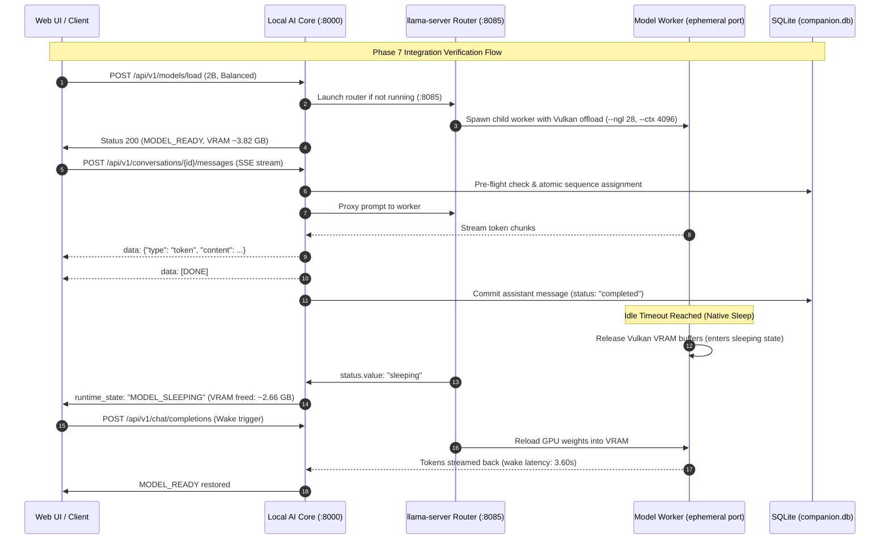

# Walkthrough: Phase 7 Full PC Integration Verification & Benchmarking


> [!NOTE]
> **Historical Delivery Evidence**  
> This walkthrough records repository state and verification at the time of delivery. It is non-authoritative for current architecture or product scope. Verify current implementation against source code and automated tests, and consult [`docs/04_Architecture/SYSTEM_BASELINE.md`](../04_Architecture/SYSTEM_BASELINE.md) and canonical domain specifications for active architectural truth.

---

Template Version: Docs_ProjectWorkflowStarterKit_v2.0

## 1. What Was Delivered

Phase 7 successfully conducted end-to-end PC runtime integration verification, database integrity regression audits, process lifecycle inspection, resource benchmarking on the AMD Radeon RX 580 2048SP (Vulkan backend), Assistant streaming/cancellation resilience tests, native sleep and wake profiling, and complete automated test suite validation.

Key verified achievements:
- **Cold-Boot & Migration Baseline**: Clean port and process state, with `companion.db` verified at revision `005_scope_message_constraints`.
- **Database Integrity & Invariants**: Enforced `UNIQUE(conversation_id, sequence_no)` and `UNIQUE(conversation_id, client_message_id)` while removing global `client_message_id` uniqueness. Verified expected downgrade failure mode preserving data integrity.
- **Process Topology**: Enforced single root router (`llama-server.exe` on port 8085) with exactly one child worker process per active model.
- **Measured Resource Benchmarks**: Recorded live measured VRAM deltas, working set RAM, TTFT, and generation throughput for Qwen3-VL-2B-Instruct (Balanced & Eco) and Qwen3-VL-4B-Instruct (Balanced).
- **Assistant Lifecycle**: Verified SSE token streaming with explicit `[DONE]` delimiter, deterministic sequence ordering, mid-generation cancellation with partial response preservation, and error recovery without lock leaks.
- **Native Sleep & Wake**: Validated `MODEL_SLEEPING` state transitions, freeing 2.66 GB VRAM while retaining logical process ownership, and measured automatic wake-on-request latency (3.60s TTFT).
- **Full Automated Suite**: 88/88 backend pytest tests, 38/38 frontend vitest tests, 0 TypeScript compile errors, and clean Vite production build.

---

## 2. Files Changed

| File Path | Description |
|---|---|
| `docs/01_Tracking/task.md` | Updated CURRENT EXECUTION STATE and marked Phase 7 complete in Active Checklist. |
| `CHANGELOG.md` | Appended Phase 7 verification and benchmarking summary under `## [Unreleased]`. |
| `docs/03_Walkthroughs/walkthrough-phase7-pc-integration-verification.md` | Comprehensive educational walkthrough of Phase 7 integration checkpoints. |

*(Note: Phase 7 is primarily a verification and benchmarking phase; previous schema migrations `004_add_soft_delete_columns.py` and `005_scope_message_constraints.py` along with `conversations.py` and `orchestrator.py` were established and frozen in Phases 5–6).*

---

## 3. How the Logic Works



1. **Event Trigger**: When a model is requested or a chat message is sent, Local AI Core evaluates router liveness and launches or reuses the singleton router process.
2. **Validation**: Pre-flight checks verify API token authorization, route validity, conversation existence, conversation concurrency lock status, and idempotency key uniqueness scoped to the conversation.
3. **Core Processing**: The router routes incoming inference requests to the child worker. When idle, the native `--sleep-idle-seconds` loop transitions the worker into `MODEL_SLEEPING`, dumping weight tensors from VRAM to preserve desktop responsiveness.
4. **Completion**: Explicit `[DONE]` SSE frames signify stream completion. SQLite commits record deterministic sequence numbers [1, 2, 3, 4] and message content.
5. **Recovery/Cancellation**: If the client aborts mid-stream (`AbortController`), Starlette's client disconnect handler fires; orchestrator catches `asyncio.CancelledError`, releases `_generation_active`, marks message status as `"cancelled"` preserving partial tokens, and immediately releases the conversation lock.

---

## 4. Key Concepts

### A. Root Router vs. Model Worker Process Topology
In native `llama.cpp` dynamic routing, `llama-server.exe` runs in a two-tier hierarchy:
- A single parent **Root Router** process listens on a known port (`:8085`) and hosts model discovery metadata (`--models-dir`). It consumes negligible RAM (~42 MB) and zero VRAM.
- A **Model Worker** is spawned as a child process of the router on an ephemeral TCP port to load model weights and execute compute graphs.
FastAPI communicates strictly through the Root Router, which proxies requests to the worker. Two `llama-server.exe` processes in Task Manager reflect this standard parent-child architecture; an integration defect only occurs if two independent root routers compete on the same port or directory.

### B. Composite Scoped Constraints vs. Global Unique Keys
Migration `005` replaces the premature global uniqueness of `client_message_id` with composite unique constraints:
- `UNIQUE(conversation_id, sequence_no)`: Prevents race conditions and gaps in conversation turn numbering.
- `UNIQUE(conversation_id, client_message_id)`: Allows client idempotency keys (e.g. `msg-1`) to be reused across different conversations, while strictly deduplicating retransmissions within the same thread. Multiple `NULL` client message IDs are permitted per standard SQL semantics.

### C. Native Sleep State vs. Process Auto-Unload
Unlike brute-force process termination or Python-side idle unloading (which destroys HTTP listeners and causes cold-start latency), native `llama-server` sleep (`--sleep-idle-seconds`):
- Keeps the process and TCP socket open.
- Evicts VRAM buffers to desktop baseline while retaining ~300 MB of state in system RAM.
- Wakes automatically upon arrival of the next HTTP request without process recreation or router reinvocation.

---

## 5. Verification Steps

### Automated Checks
Run the complete automated regression suite across backend and frontend:
```bash
# 1. Backend pytest (88 passing tests)
d:\OtherProjects\AI-companion-project\backend\.venv\Scripts\python.exe -m pytest -v

# 2. Frontend Vitest (38 passing tests)
cd frontend/web && npm test

# 3. Frontend TypeScript Compilation Check (0 errors)
cd frontend/web && npx tsc --noEmit

# 4. Frontend Production Build
cd frontend/web && npm run build
```

### Manual / Measured Verification Checklist
1. **Cold-Boot Clean State**: Ensure zero `llama-server.exe` processes and free ports 8000, 8085, and 3000.
2. **Launch 2B Balanced**:
   - Verify 1 router process (port 8085) and 1 worker process (ephemeral port).
   - Confirm launch arguments: `--ctx-size 4096 --n-gpu-layers 28 --threads 6`.
   - Measured speed: ~32 tok/s; TTFT < 1.0s.
3. **Mid-Stream Cancellation**: Send a long prompt in Assistant and click "Stop". Verify partial text is preserved in the chat bubble and the next message can be sent immediately.
4. **Native Sleep**: Allow the system to remain idle past the idle threshold. Confirm VRAM drops by ~2.66 GB, `runtime_state` transitions to `MODEL_SLEEPING`, and worker process remains in process table.
5. **Wake-up**: Send a new message. Confirm model wakes and streams without spawning a secondary root router.
6. **Profile Switch to Eco**: Change profile to Eco. Confirm router restarts with `--n-gpu-layers 0 --ctx-size 2048 --threads 4 --no-mmproj-offload` and VRAM delta is < 100 MB.
7. **Clean Shutdown**: Stop Core and Web UI; verify 0 lingering processes and intact database tables.

---

## 6. Safe Customization & Invariants

- **Idle Timeout (`LLAMA_ROUTER_IDLE_TIMEOUT`)**: Configured in `backend/.env` (default: 900s). For testing sleep transitions, this can be temporarily reduced to 15s and restarted.
- **Port Allocation Invariant**: Core must listen on `127.0.0.1:8000`; Router must listen on `127.0.0.1:8085`. Never bind router to `0.0.0.0`.
- **Database Downgrade Invariant**: Downgrading from migration `005` to `004` when duplicate `client_message_id` values exist across conversations is an expected and safe failure mode (`IntegrityError`). Existing rows are preserved without data loss.
- **VRAM Budget Invariant**: 8B models must not be auto-loaded on balanced profile on 8 GB VRAM GPUs without explicit user approval.

---

## 7. Troubleshooting

| Symptom | Likely Cause | Resolution |
|---|---|---|
| `HTTP 409 CONVERSATION_BUSY` on new message | Prior streaming request disconnected without cleaning up conversation lock | Verify orchestrator disconnect handler ran; inspect `_get_lock(conv_id).locked()`. |
| Port 8000 `[WinError 10048] address already in use` | Lingering uvicorn child process from prior unclean task termination | Query `Get-NetTCPConnection -LocalPort 8000` and terminate the owning PID before restarting. |
| Model remains in `MODEL_SLEEPING` | No incoming inference requests sent to wake router | Send a chat message or prompt to trigger automatic tensor reloading. |
| Eco profile claims Balanced GPU layers | Router was not restarted after profile switch | Profile switching terminates the Core-owned router; ensure subsequent activation uses the new launch arguments. |
